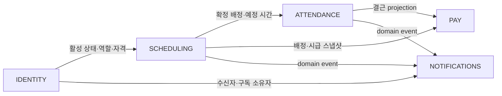

# 라비에벨 도메인 언어와 경계

- 상태: MVP 기준
- 기준일: 2026-07-23
- 관련 문서: [PRD](PRD.md), [Architecture](ARCHITECTURE.md), [ADR](adr/README.md)

## 목적

이 문서는 코드와 대화에서 사용할 공통 언어와 논리적 도메인 경계를 정의한다. 경계는 하나의 Next.js·PostgreSQL 애플리케이션 안에서 책임과 트랜잭션을 분리하기 위한 것이며, 마이크로서비스나 별도 데이터베이스를 뜻하지 않는다.

## 공통 언어

| 업무 용어 | 코드 용어 | 의미 |
| --- | --- | --- |
| 근무자 | `worker` / `profile` | 승인 후 신청·배정될 수 있는 사람. 관리자를 포함할 수 있다. |
| 관리자 | `admin` | 운영 권한을 가진 역할. `매니저` 포지션과 다르다. |
| 슈퍼 관리자 | `super_admin` | 관리자 임명·해제 권한까지 가진 역할. |
| 당일 팀장 | `day_lead` | 전역 역할이 아니라 해당 날짜의 `팀장` 확정 배정에서 파생되는 권한. |
| 모집 | `work_schedule` in `OPEN` | 근무일과 신청 마감일을 공개해 가능 근무자를 받는 과정. |
| 신청 | `schedule_application` | 근무 가능 여부. 희망 포지션을 뜻하지 않는다. |
| 필요 인원 | `position_requirement` | 스케줄과 포지션별로 필요한 정식 담당자 수의 스냅샷. |
| 배정 | `assignment` | 한 근무자가 하루 스케줄에 참여한다는 기록. |
| 담당 포지션 | `assignment_position` | 한 배정이 충족하는 하나 이상의 포지션. |
| 교육생 | `trainee_link` | 담당자와 포지션에 연결되지만 필요 인원을 충족하지 않는 근무자. |
| 확정 | `confirmation` | 배정과 예정 시간, 시급 스냅샷을 공개 가능한 revision으로 고정하는 행위. |
| 변경 요청 | `change_request` | 확정 후 취소·특정 교대·공개 교대를 처리하는 workflow. |
| 출퇴근 원본 | `attendance_event` | 서버 시각으로 생성되는 수정·삭제 불가능한 출근 또는 퇴근 사건. |
| 현장 확인 | `attendance_attestation` | 팀장 또는 관리자가 원본을 바꾸지 않고 추가하는 확인·결근 사건. |
| 출결 상태 | `attendance_projection` | 원본과 현장 확인을 합성한 조회 결과. 원본 데이터가 아니다. |
| 예상 급여 | `estimated_pay` | 예정 시간 또는 리허설 자기기록으로 계산한 참고 금액. 실제 정산이 아니다. |
| 리허설 | `rehearsal_entry` | 일반 스케줄·공식 출퇴근과 분리된 근무자 자기기록. |
| 완전 삭제 | `permanent_deletion` | 앱 밖에서 직접 요청받아 관리자가 복구 정보를 파기하고 과거 기록을 익명화하는 비가역 command. |

새 용어를 도입할 때 기존 용어로 표현할 수 있는지 먼저 확인한다. 같은 개념에 여러 이름을 붙이거나 `관리자`와 `매니저`, `출퇴근 원본`과 `출결 상태`를 섞어 쓰지 않는다.

## 논리적 도메인 경계

| ID | 책임 | 소유 데이터 | 외부에서 받는 정보 |
| --- | --- | --- | --- |
| `DOMAIN:IDENTITY` | 가입, 승인, 역할, 개인정보, 시급, 가능 포지션, 탈퇴 복구 | profile, role, eligibility, departed vault | Google 인증 결과 |
| `DOMAIN:SCHEDULING` | 모집, 신청, 예식, 필요 인원, 배정, 확정, 취소·교대 | schedule, application, ceremony, requirement, assignment, change request | 활성 계정과 포지션 자격 |
| `DOMAIN:ATTENDANCE` | GPS·QR 인증, 불변 원본, 팀장 확인, 출결 projection | attendance event, attestation, QR key | 확정 배정과 예정 시간 |
| `DOMAIN:NOTIFICATIONS` | 앱 내 알림, 푸시 구독, outbox, 재시도 | notification, subscription, outbox | 다른 도메인의 사건 |
| `DOMAIN:PAY` | 예정 급여 조회와 리허설 자기기록 | pay projection, rehearsal entry | 배정 스냅샷과 결근 projection |

`DOMAIN:*` ID는 작업 인덱스의 `spec_refs`에서 사용한다.

## Context 관계

화살표는 데이터 소유권이 아니라 소비 방향이다. 소비 도메인이 다른 도메인의 소유 데이터를 직접 수정하지 않는다.

## Aggregate와 일관성 경계

### Profile

- 승인 상태, 역할, 개인 시급, 가능 포지션의 소유자다.
- 역할 변경, 계정 복구, 완전 삭제는 서버 command에서 권한 확인과 감사 기록을 함께 저장한다.
- 근무자는 일반 탈퇴만 직접 실행한다. 완전 삭제 command는 관리자만 실행할 수 있고 대상 이름 재입력을 검증한다.
- 다른 도메인은 profile을 직접 변경하지 않고 활성 상태와 자격만 조회한다.

### WorkSchedule

- 모집 상태, 예식, 예정 시간, 필요 인원, 배정, revision의 일관성 경계다.
- 확정과 확정 후 변경은 하나의 트랜잭션 command로 처리한다.
- 부족 인원은 경고 결과이며 트랜잭션 실패 조건이 아니다.
- 신청과 변경 요청은 별도 생명주기를 가지지만 승인 시 WorkSchedule을 잠그고 재검증한다.

### Attendance stream

- 한 배정의 출근·퇴근 원본과 확인 사건은 append-only stream이다.
- 원본과 확인을 합성한 projection은 사실의 원본이 아니며 언제든 재생성할 수 있어야 한다.
- 잘못된 원본을 수정하지 않고 후속 확인 사건으로 설명한다.

### RehearsalEntry

- 근무자가 소유하는 독립 자기기록이다.
- 생성 시 시급을 스냅샷하며 일반 스케줄, 배정, 공식 출퇴근과 연결하지 않는다.

## Domain event

다른 도메인에 후속 처리가 필요한 성공한 상태 변화는 과거형 사건으로 표현한다.

- `RecruitmentOpened`
- `ScheduleConfirmed`
- `ConfirmedScheduleRevised`
- `ChangeRequestSubmitted`
- `ChangeRequestResolved`
- `AttendanceRecorded`
- `AttendanceMissingDetected`
- `AccountDeparted`
- `AccountHistoryRestored`
- `AccountPermanentlyDeleted`

MVP에서 별도 event bus를 만들지 않는다. 같은 데이터베이스 트랜잭션의 `notification_outbox`와 감사 기록이 필요한 사건만 영속화한다.

## 구현 원칙

- 모듈은 위 도메인 경계를 따르되 테이블마다 repository·service 계층을 만들지 않는다.
- 여러 aggregate나 민감 정보를 변경하는 작업만 명시적 command로 구현한다.
- 단순 조회와 본인 CRUD는 RLS와 작은 query 함수로 처리한다.
- 도메인 객체가 프레임워크와 분리될 가치가 있는 계산·검증만 순수 TypeScript 또는 SQL 함수로 둔다.
- 새로운 추상화, event bus, CQRS read store, 마이크로서비스는 현재 인수 조건에 필요할 때만 ADR과 task를 추가한다.
