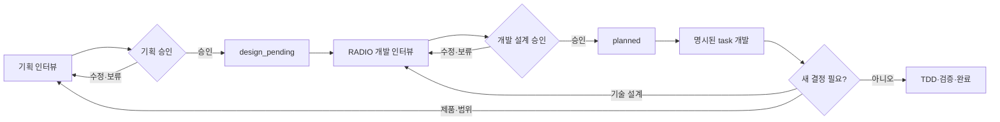

# 기획 인터뷰, RADIO 개발 인터뷰와 자율 개발 운영 계약

- 상태: Accepted
- 기준일: 2026-07-24
- 관련 결정: [ADR-0009](adr/0009-two-track-interview-and-engineering-loop.md), [ADR-0011](adr/0011-planning-radio-development-contract.md)

## 목적

이 프로젝트는 설계와 실행을 세 단계로 분리한다. 사용자는 기획 인터뷰에서 무엇을 왜 만들지 승인하고, 개발 인터뷰에서 RADIO를 사용해 어떻게 만들지 승인한다. AI는 두 승인을 받은 작은 task만 자율 개발 루프에서 구현한다.



자동화는 승인된 `planned → done` 구간을 깊게 담당한다. 기획과 개발 설계는 인터뷰와 사용자 승인 없이 자동화하지 않는다.

기존 가드가 부르는 `딥인터뷰 설계 루프`는 P0-T28 전환 기간에 아래 트랙 A1과 A2를 합친 의미다.

## 공통 인터뷰 계약

두 인터뷰는 다음 방식을 공유한다.

1. 한 번에 주 질문 하나만 묻는다.
2. 실제 선택이 있으면 장점, 비용과 되돌릴 수 있는 정도가 다른 2~3개 선택지를 제시한다.
3. 구체적인 추천 답변, 이유와 핵심 트레이드오프를 함께 제공한다.
4. 사용자 답변을 `확인된 사실`, `해석`, `가정`, `미결 사항`으로 구분한다.
5. 침묵이나 추천 수락을 추정하지 않고 승인, 수정 또는 보류를 명시적으로 확인한다.
6. 이미 승인된 결정을 충돌이나 공백 없이 다시 열지 않는다.
7. 인터뷰 중 제품 코드를 구현하거나 task를 `in_progress`로 바꾸지 않는다.

## 트랙 A1: 기획 인터뷰

### 대상

- 제품 목표, 사용자, MVP 범위와 우선순위
- 프로젝트 단계, 리스크, 운영 방식과 성공 기준
- 도메인 언어, 권한 정책, 데이터 수명주기와 불변 규칙
- UX 흐름, 디자인 원칙과 제품 인수 조건
- task 분해와 의존성

### 깊이 전략

모든 결정에서 최소한 다음을 확인한다.

- 행위자, 조회·실행·승인·강제 처리 권한과 개인정보 공개 범위
- 실행 전제조건, 차단·경고·허용 규칙, 상태 전이와 시간 경계
- 데이터 원본, 소유권, 수정·삭제·스냅샷·보존·복구 규칙
- 성공 결과와 파급 효과, 알림, 감사와 운영자가 확인할 정보
- 정상 흐름, 실패·재시도·복구, 수동 예외 처리와 우회 불가 규칙
- MVP 비목표, 의존성, 출시 조건과 검증 가능한 제품 인수 조건

권한, 개인정보, 금액, 출퇴근 원본, 불가역 작업, 외부 서비스, 시간 기반 자동화 또는 동시 변경이 포함되면 다음 경계를 심화한다.

- 경계값과 정확한 시간 경계
- 복수 역할과 자기 자신 처리
- 동시·중복·오래된·역순 요청
- 진행 중 상태 변화, 누락·오염 데이터와 과거 이력
- 데이터 변경 후 알림 실패 같은 부분 실패
- 불변 원본과 후속 확인 사실의 충돌
- 운영자 실수·권한 악용과 감사 회피
- 기기·네트워크·위치·푸시·접근성 차이
- 탈퇴·휴면·취소·만료가 미래·진행 중 작업에 미치는 영향

정상 흐름, 대표 엣지 케이스, 실패·복구, 수동 탈출구, 데이터 이력, 비목표와 검증 증거가 정해져 개발 인터뷰가 제품 판단을 다시 하지 않아도 될 때 기획 설계가 완료된다.

### 기획 인계

사용자 승인 후에만 PRD → Domain → ADR → Architecture·Design → Phase 순서로 문서를 정합화한다. task에 목표, 비목표, 주요 경계 사례, 제품 인수 조건, 의존성, `spec_refs`와 `product_approval`을 기록하고 `design_pending`으로 둔다.

## 트랙 A2: RADIO 개발 인터뷰

### 대상

기획 승인을 받은 `design_pending` task의 구현 요구, 아키텍처, 데이터, 인터페이스와 최적화를 결정한다. 승인된 제품 동작은 다시 결정하지 않는다.

1. **Requirements**: 구현 범위, 불변 규칙, 기술 인수 조건과 테스트 위험
2. **Architecture**: FSD·도메인 책임, 의존 방향, 서버 경계, 보안과 재사용
3. **Data model**: 정본, 스키마, RLS, 수명주기, migration, 트랜잭션과 동시성
4. **Interface**: 입력·DTO·오류·멱등성, 캐시, 오프라인과 외부 계약
5. **Optimizations**: 성능 근거, 관측성, 의존성, 복잡도와 되돌림

모든 task는 RADIO를 갖되 위험에 따라 깊이를 조절한다.

- 문서·문구·기계적 설정: 관련 `DEV-*` 규칙의 적용 상태와 새 결정 유무만 기록한다.
- 일반 기능·UI·API: 작업에 관련된 RADIO 항목과 실제 기술 선택만 인터뷰한다.
- 권한·개인정보·금액·출퇴근·DB·외부 서비스·캐시·오프라인·동시성: 전체 RADIO와 심화 보안·데이터·실패·복구를 검토한다.

공통 규칙을 반복하지 않는다. 각 항목은 규칙 ID와 `기본 적용`, `해당 없음`, `추가 결정`, `예외` 중 하나를 기록하고 상세 내용은 추가 결정이나 허용된 예외에만 쓴다.

승인된 정본은 `docs/development/<task-id>-radio.md`에 둔다. 여러 task에 영향을 주거나 되돌리기 어려운 결정은 ADR로 승격한다. `development_approval`, `radio_ref`, `test_mode`, 실행 가능한 `check_ids`가 모두 기록된 뒤에만 task를 `planned`로 바꾼다.

## 상태와 승인 계약

```text
proposed
→ design_pending
→ planned
→ in_progress
→ done
```

- `proposed`: 기획 설계 미승인.
- `design_pending`: `product_approval`은 있으나 RADIO 개발 설계가 미승인.
- `planned`: `product_approval`, `development_approval`, `radio_ref`와 실행 계약이 모두 승인됨.
- `in_progress`: 사용자가 명시한 task ID 하나를 구현 중.
- `done`: 인수 조건과 등록 검증을 통과하고 증거가 남음.

모든 task는 schema v3의 `approval_contract`를 명시한다. 전환 전에 종료된 `done`·`skipped`만 `legacy-v2`를 사용하고 실행 상태로 돌아갈 수 없다. 현재 미완료와 신규 task는 `dual-approval-v3`를 사용한다. 이 계약의 개발 승인은 RADIO의 revision과 정확한 전체 파일 SHA-256을 기록하며, 경로·파일·해시가 유효하지 않으면 실행할 수 없다.

`dual-approval-v3` task를 구현하지 않기로 결정하면 사용자, 날짜와 이유가 있는 `skip_approval`로 `skipped` 처리한다. 제품·개발 승인과 RADIO는 건너뛰기의 선행 조건이 아니며 task ID와 이력은 삭제하지 않는다.

개발 루프로 넘기는 task는 다음 조건을 모두 만족해야 한다.

- 사용자가 기획 범위와 RADIO를 각각 명시적으로 승인했다.
- 목표, 비목표, 주요 경계 사례와 완료 조건이 Phase 문서에 있다.
- 관련 PRD·Domain·ADR·Architecture·Design이 `spec_refs`로 추적된다.
- task별 승인된 RADIO가 `radio_ref`로 연결된다.
- `test_mode`와 실행 가능한 `check_ids`가 있다.
- 의존 task가 모두 `done`이다.
- 구현자가 새 제품 또는 기술 설계를 결정하지 않아도 완료할 수 있다.

하나라도 빠지면 실행할 수 없다.

## 트랙 B: 자율 개발 루프

사용자가 승인된 task ID의 실행을 요청하면 다음 루프를 수행한다.

1. 명시된 task, 두 승인, RADIO와 의존성을 검증한다.
2. 격리 worktree에서 task 하나만 `in_progress`로 전환한다.
3. `.agents/runs/<task-id>/radio.md`에 승인된 RADIO의 적용 결과와 구현 중 차이를 기록한다.
4. TDD task는 가치 있는 실패 RED를 만든 뒤 같은 명령의 GREEN을 달성한다.
5. 승인된 범위만 구현하고 등록 check와 회귀 검사를 실행한다.
6. 기술적 실패는 현재 작업을 보존하면서 설정된 횟수 안에서 자동 재시도한다.
7. 모든 검증, 증거, task 상태와 단일 commit 계약을 확인한 뒤 통합한다.
8. 결과를 사용자에게 보고하고 멈춘다. 다음 task를 자동 선택하지 않는다.

## 루프 중단과 인터뷰 반환

- 제품 동작, 범위, 역할, 개인정보 정책 또는 운영 정책 판단은 기획 인터뷰로 반환한다.
- Architecture, Data model, Interface, Optimizations 또는 공통 개발 규칙의 판단은 개발 인터뷰로 반환한다.
- `MUST` 규칙은 task RADIO에서 면제하지 않는다. 규칙이 부적절하면 개발 인터뷰에서 기준 문서와 필요한 ADR을 먼저 변경한다.
- `SHOULD` 예외는 이유, 트레이드오프, 위험, 보완책과 되돌림 조건을 RADIO에 기록하고 사용자 승인을 받는다.
- task를 완료하려면 비목표나 다른 task가 필요할 때 현재 범위에 몰래 포함하지 않는다.

실행 중 새 판단이 발견되면 runner는 task를 먼저 `blocked`로 안전 중단하고 `.agents/runs/<task-id>/decision-signal.json`, 격리 작업물과 실행 증거를 보존한다. 결정 신호는 영역, 발견 이유, 영향받는 문서·task, 확정 사항과 미결 질문을 포함한다. 인터뷰가 영역을 확인하기 전에는 승인 기록을 자동 수정하거나 미완성 작업을 삭제·commit하지 않는다.

- 제품 동작이나 범위가 바뀌면 `proposed`로 반환하고 제품·개발 승인을 다시 받는다.
- 기술 설계만 바뀌면 제품 승인을 보존하고 `design_pending`으로 반환해 개발 승인만 다시 받는다.
- 재승인 후에는 새 RADIO 해시와 실행 계약을 검증하고 호환되는 격리 작업물만 이어서 사용한다.

## 전환 규칙

- 완료된 task는 당시 계약에 따른 이력으로 보존하고 소급 RADIO를 만들지 않는다.
- 기획만 승인됐던 `P1-T06`과 `P7-T01`은 제품 승인 기록을 보존한 채 `design_pending`으로 전환한다.
- P0-T28은 기존 v2 runner가 최초 선택할 수 있도록 `approved_by`와 `approved_at`을 임시 병기한다. 새 계약과 runner가 GREEN이 되면 완료 commit 전에 제거한다.
- P0-T28이 완료될 때까지 기존 통합 딥인터뷰 스킬은 전환용 진행자로 유지한다.
- 새 두 인터뷰 스킬과 하네스 검증이 통과한 뒤 기존 통합 스킬을 제거한다.
