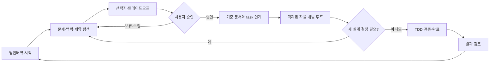

# 딥인터뷰 설계와 자율 개발 운영 계약

- 상태: Accepted
- 기준일: 2026-07-24
- 관련 결정: [ADR-0009](adr/0009-two-track-interview-and-engineering-loop.md)

## 목적

이 프로젝트는 사람과 AI의 역할을 두 트랙으로 분리한다. 사용자는 제품과 프로젝트의 방향을 AI와 깊게 설계하고, AI는 승인된 설계를 작은 실행 계약으로 받은 뒤 개발 루프를 자율적으로 수행한다.

자동화는 `E → H` 구간을 깊게 담당한다. `A → D`의 제품·프로젝트·개발 설계 결정은 인터뷰와 사용자 승인 없이 자동화하지 않는다.

## 트랙 A: 딥인터뷰 설계 루프

### 대상

- 제품 목표, 사용자, MVP 범위와 우선순위
- 프로젝트 단계, 리스크, 운영 방식과 성공 기준
- 도메인 언어, 권한, 데이터 수명주기와 불변 규칙
- 아키텍처, API, 데이터 모델, 보안과 배포 결정
- UX 흐름, 디자인 원칙과 인수 조건
- task 분해, 의존성, 검증 방식

### 인터뷰 한 사이클

1. **초점 설정**: 이번 대화에서 결정할 한 가지 주제와 결정하지 않을 범위를 합의한다.
2. **맥락 탐색**: 현재 방식, 실제 사용자, 빈도, 예외, 실패 비용, 운영 제약과 성공 모습을 한 번에 질문 하나씩 묻는다.
3. **이해 반영**: AI가 `확인된 사실`, `해석`, `가정`, `미결 사항`을 분리해 요약한다.
4. **깊이 검증**: 정상 흐름뿐 아니라 권한, 데이터, 실패·복구, 경계 사례와 MVP 제외 범위를 확인한다.
5. **선택지 비교**: 의미 있는 선택이 있을 때 2~3개 안과 장단점, 추천 답변과 이유를 함께 제시한다. 사실 확인 질문에는 사실을 추측하지 않고 현재 문서 기준 답변 초안이나 답변 형식을 추천한다.
6. **결정 확인**: 사용자가 승인, 수정 또는 보류를 명시한다. 침묵이나 AI의 추천은 승인이 아니다.
7. **문서화**: 승인된 내용만 기준 문서와 task 계약에 반영한다.

인터뷰 중에는 제품 코드를 구현하거나 task를 `in_progress`로 바꾸지 않는다. 문서 초안 작성 요청은 가능하지만 승인 전에는 초안임을 명시한다.

### 인터뷰 깊이 전략

인터뷰는 모든 주제에 같은 고정 질문지를 반복하지 않는다. 대신 **공통 최소 결정 렌즈와 주제별 엣지 케이스 팩을 결합**한다. 이미 승인된 제품 구조와 불변 규칙은 충돌이나 빈틈이 발견되지 않는 한 다시 결정하지 않고, 구현자가 새 제품 판단을 해야 할 모호한 부분을 찾는 데 집중한다.

모든 결정 주제에서 최소한 다음을 확인한다.

- 행위자, 조회·실행·승인·강제 처리 권한과 개인정보 공개 범위
- 실행 전제조건, 차단·경고·허용 규칙, 상태 전이와 시간 경계
- 데이터 원본, 소유권, 수정·삭제·스냅샷·보존·복구 규칙
- 성공 결과와 파급 효과, 알림, 감사, 운영자가 확인할 정보
- 정상 흐름, 실패·재시도·복구, 수동 예외 처리와 우회 불가 규칙
- MVP 비목표, 의존성, 출시 조건과 검증 가능한 인수 조건

주제에 권한, 개인정보, 금액, 출퇴근 원본, 불가역 작업, 외부 서비스, 시간 기반 자동화 또는 동시 변경이 포함되면 관련 엣지 케이스 팩을 더 깊게 적용한다.

- 경계값과 정확한 시간 경계
- 한 사용자의 복수 역할과 자기 자신에 대한 처리
- 동시 요청, 중복 제출, 재시도, 오래된 화면과 역순 사건
- 진행 중 상태 변화, 누락·오염된 데이터와 과거 이력의 충돌
- 데이터 변경 성공 후 알림 실패 같은 부분 실패
- 불변 원본과 후속 확인 사실의 충돌
- 운영자 실수·권한 악용과 감사 회피 가능성
- 기기, 네트워크, 위치, 푸시, 접근성 환경의 차이
- 탈퇴, 정지, 취소, 만료가 미래 작업과 진행 중 요청에 미치는 영향

결정은 정상 흐름뿐 아니라 대표 엣지 케이스, 실패·복구 방식, 수동 탈출구, 데이터 이력, 명시적 비목표와 검증 증거가 정해져 구현자가 추가 제품 판단 없이 완료할 수 있을 때만 충분히 구체적인 것으로 본다. 사용자에게는 한 번에 주 질문 하나만 제시하고, 연결된 후속 질문은 다음 응답 차례로 넘긴다. 설명과 선택지는 질문을 이해하는 데 필요한 만큼 제공할 수 있지만 여러 사실 확인이나 결정을 한꺼번에 요구하지 않는다.

## 설계에서 개발로 넘기는 인계 계약

개발 트랙으로 넘기는 task는 다음 조건을 모두 만족해야 한다.

- 사용자가 task 범위와 인수 조건을 명시적으로 승인했다.
- `status`가 `planned`이고 `approved_by: "user"`, `approved_at`이 있다.
- 목표, 비목표, 주요 경계 사례와 완료 조건이 Phase 문서에 있다.
- 관련 PRD·Domain·ADR·Architecture·Design이 `spec_refs`와 문서 링크로 추적된다.
- 의존 task가 모두 `done`이다.
- `test_mode`와 실행 가능한 `check_ids`가 있다.
- 구현자가 새 제품 결정을 내리지 않아도 작업을 완료할 수 있다.

하나라도 빠지면 task는 `proposed`로 유지하고 트랙 A에서 보완한다.

## 트랙 B: 자율 개발 루프

사용자가 승인된 task ID의 실행을 요청하면 AI와 하네스는 다음 루프를 자율적으로 수행한다.

1. 명시된 task와 인계 계약을 검증한다.
2. 격리 worktree에서 task 하나만 `in_progress`로 전환한다.
3. 관련 원문을 읽고 RADIO에 구현 판단과 영향 범위를 기록한다.
4. TDD task는 가치 있는 실패 RED를 만든 뒤 같은 명령의 GREEN을 달성한다.
5. 최소 범위로 구현하고 등록 check와 회귀 검사를 실행한다.
6. 기술적 실패는 현재 작업을 보존하면서 설정된 횟수 안에서 자동 재시도한다.
7. 모든 검증과 증거, task 상태, 단일 commit 계약을 확인한 뒤 통합한다.
8. 결과를 사용자에게 보고하고 멈춘다. 다음 task를 자동 선택하지 않는다.

## 루프 중단과 트랙 반환

다음 상황은 기술적 재시도 대상이 아니라 트랙 A로 반환할 설계 신호다.

- 기준 문서끼리 충돌한다.
- 인수 조건을 만족하는 방법이 제품 동작이나 범위를 바꾼다.
- 새 역할·권한·개인정보·데이터 보존 정책 결정이 필요하다.
- 의존성 또는 외부 서비스 선택이 승인 범위를 벗어난다.
- task를 완료하려면 비목표나 다른 task를 함께 구현해야 한다.

AI는 이런 신호를 임의 선택으로 숨기지 않고 `필요한 결정`, `영향`, `가능한 선택지`를 정리해 인터뷰를 재개한다.

## 현재 문서와 task의 취급

2026-07-24 이전에 작성된 미구현 제품 계획과 설계는 삭제하지 않는다. 유용한 출발점이므로 보존하되, 관련 task는 `proposed`로 두고 딥인터뷰에서 승인한 단위만 `planned`로 승격한다. 완료된 P0 하네스 작업의 이력과 증거는 그대로 유지한다.
