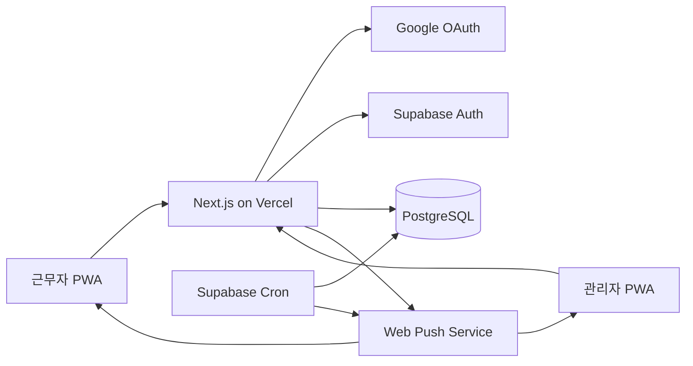
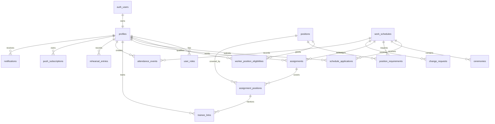
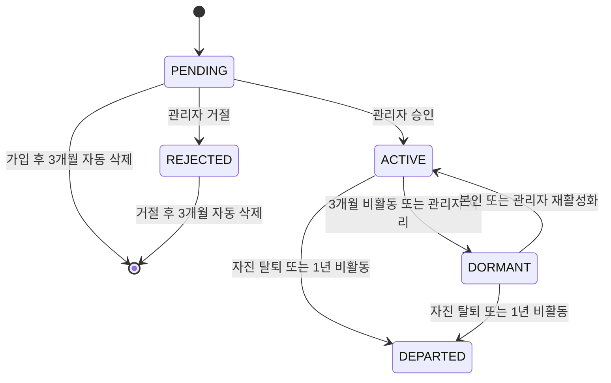
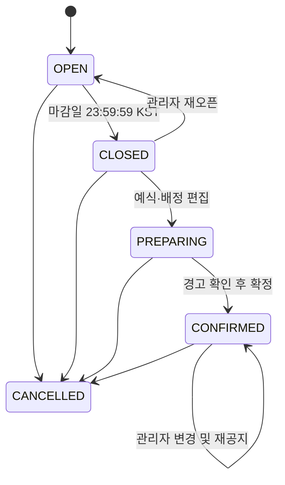

# 라비에벨 시스템 아키텍처

- 상태: 인터뷰 재검토 기준안
- 기준일: 2026-07-24
- 관련 문서: [PRD](../product/PRD.md), [Domain](../product/DOMAIN.md), [ADR](adr/README.md), [Phase](../execution/phases/README.md)

이 문서는 기존 설계를 보존한 인터뷰 출발점이다. 승인된 task가 참조하는 범위만 현재 구현 결정으로 사용한다.

## 1. 아키텍처 목표

- 모바일 PWA 하나로 근무자와 관리자 경험을 제공한다.
- 권한과 개인정보 접근을 데이터 계층에서도 강제한다.
- 출퇴근 원본 시각과 감사 기록을 변조할 수 없게 한다.
- 월 8개 스케줄 규모에서 운영 복잡도를 최소화한다.
- MVP 밖 기능을 위한 추상화를 미리 만들지 않는다.

## 2. 기술 구성

| 영역 | 선택 |
| --- | --- |
| 웹 애플리케이션 | Next.js App Router, TypeScript |
| UI | Tailwind CSS, shadcn/ui, 모바일 우선 |
| 인증 | Supabase Auth, Google OAuth |
| 데이터베이스 | Supabase PostgreSQL, Seoul 리전 |
| 권한 | PostgreSQL RLS, 보안 함수, 서버 전용 작업 |
| 푸시 | Service Worker, Web Push, VAPID |
| 예약 작업 | Supabase Cron, Edge Function |
| 호스팅 | Vercel |
| 테스트 | Vitest, Playwright, SQL/RLS 테스트 |

## 3. 시스템 컨텍스트



## 4. 애플리케이션 경계

### 브라우저

- 화면 표시, 폼 입력, 위치 권한 요청, QR 스캔, 푸시 구독을 담당한다.
- 클라이언트 시각은 출퇴근 원본으로 사용하지 않는다.
- UI에서 버튼을 숨기는 것만으로 권한을 보장하지 않는다.

### Next.js 서버 경계

- Google OAuth callback과 세션 처리를 담당한다.
- 관리자 변경, 배정 확정, 교대 승인처럼 여러 테이블을 원자적으로 변경하는 작업을 수행한다.
- VAPID 비밀키와 Supabase service role 키를 브라우저에 노출하지 않는다.
- 요청 사용자의 계정 상태와 역할을 다시 확인한다.

### 코드 구조와 개발 가드

- 구현의 FSD 계층, server-first 경계, 공통 `DEV-*` 규칙과 RADIO 승인·검증 흐름은 [개발 컨벤션](DEVELOPMENT.md), [ADR-0008](adr/0008-fsd-server-first-development-guards.md)과 [ADR-0011](adr/0011-planning-radio-development-contract.md)을 따른다.
- 모든 사용자에게 같은 public 조회만 TTL·무효화 조건을 가진 cache를 기본 허용한다. private 조회는 공유·영속 cache를 금지하고 필요한 상호작용 동안 현재 세션 메모리에서만 유지한다.
- 오프라인 영속 cache는 앱 셸과 public 리소스로 제한하며 private 업무 데이터와 mutation queue를 저장하지 않는다.

### 저장소 운영 대시보드

- 이 절은 현재 **보류** 상태다. 기존 하네스와 생성물이 제거되어 구현체가 없고, 근거 결정인 [ADR-0012](adr/0012-static-operations-dashboard.md)는 구조 재편 후 재검토 대상이다. 산출물 경로는 P0-T31 하네스 재구축에서 확정한다.
- 운영 대시보드는 작업 인덱스와 readiness 보고서에서 생성하는 로컬 정적·읽기 전용 운영 진입점이다.
- 대시보드는 현재 상태, 기준 시각·커밋, 단일 다음 행동, 직접 차단 조건, 후보와 phase 진행을 표시한다. 추천은 승인 상태와 의존성의 실행 경로를 우선하며 ROI는 별도 개선안 정렬에만 사용한다.
- 생성물은 원본을 바꾸지 않으며 task의 승인·상태·실행을 호출하지 않는다. 원본이 없거나 생성물이 오래되면 값을 추정하지 않고 누락 또는 오래됨을 표시한다.
- task 최종 상태 또는 phase 경계가 변한 실행 경로는 최신 실행 상태와 readiness 보고서를 반영해 대시보드를 재생성한다. 상세 구현 계약은 [ADR-0012](adr/0012-static-operations-dashboard.md)를 따른다.

### PostgreSQL

- 도메인 데이터의 단일 진실 공급원이다.
- RLS로 행 단위 읽기·쓰기 권한을 강제한다.
- 트랜잭션 함수로 확정, 교대, 출퇴근 기록처럼 원자성이 필요한 변경을 수행한다.
- 출퇴근 원본과 감사 로그의 UPDATE/DELETE를 금지한다.
- 시간 저장은 `timestamptz`, 날짜 표현과 마감 계산은 `Asia/Seoul`을 사용한다.

### Cron과 Edge Function

- 마감일 종료, 예약 알림, 휴면·자동 계정 정리와 탈퇴 정보 만료를 처리한다.
- 알림 outbox를 읽고 Web Push를 발송한다.
- 재시도 횟수와 마지막 오류를 기록하며 중복 발송을 막는다.

## 5. 핵심 도메인 모델

공통 언어, 논리적 context, aggregate 경계는 [Domain 문서](../product/DOMAIN.md)를 기준으로 한다. 아래 모델은 그 경계를 PostgreSQL 관계로 구현한 현재 구조다.



## 6. 주요 테이블

### 사용자와 권한

- `profiles`: 프로필, 계정 상태, 인정 활동 시각, 상태 변경 시각, 이름, 휴대폰, 성별, 생년월일, 시급.
- `user_roles`: `worker`, `admin`, `super_admin`. 관리자는 worker 권한을 포함한다.
- `departed_profile_vault`: 탈퇴 후 3년간 분리·암호화한 복구 정보.
- `positions`: 이름, 기본 필요 인원, 성별 조건, 기본 포지션 여부.
- `worker_position_eligibilities`: 개인별 정식 수행 가능 포지션.

### 장소와 설정

- `venue_settings`: 단일 장소 좌표, GPS 반경, 정확도 한도, 기본 시급.
- `check_in_rules`: 첫 예식 시작 시각과 추천 출근 시각의 규칙표.
- `weekly_qr_keys`: 수요일 시작 주차와 QR 키 버전, 활성·만료 시각.

### 스케줄

- `work_schedules`: 근무일, 신청 마감일, 상태, 예정 출퇴근, 확정 시각.
- `schedule_applications`: 신청자, 신청 상태, 신청·철회 시각.
- `ceremonies`: 순서와 시작 시각.
- `position_requirements`: 스케줄별 포지션 필요 인원 스냅샷.
- `assignments`: 근무자별 하루 배정, 시급 스냅샷, 결근 상태, 탈퇴 후 대체 필요 표시.
- `assignment_positions`: 한 배정이 담당하는 복수 포지션.
- `trainee_links`: 교육생, 포지션, 담당 assignment position. 가능 포지션은 요구하지 않지만 성별 조건은 검사한다.

### 변경 요청과 알림

- `change_requests`: 취소, 특정 교대, 공개 교대의 상태와 선택 사유.
- `change_request_candidates`: 교대 후보, 참여·읽음 시각.
- `notifications`: 앱 내 알림과 읽음 상태.
- `notification_outbox`: 푸시 발송할 사건과 멱등성 키.
- `push_subscriptions`: 사용자별 복수 기기의 Web Push endpoint.

### 출퇴근

- `attendance_events`: `check_in`, `check_out` 원본 사건, 서버 시각, 인증 방식.
- `attendance_attestations`: 팀장 또는 관리자의 현장 확인과 결근 판정.
- `attendance_projection`: 원본 사건과 확인을 합성한 조회용 상태.

### 급여 참고

- 일반 근무 예상 급여는 `assignments`의 예정 시간과 시급 스냅샷에서 계산한다.
- `rehearsal_entries`: 사용자가 직접 생성하는 날짜, 시작·종료, 시급 스냅샷.
- 실제 지급, 정산, 급여명세서 테이블은 만들지 않는다.

### 감사

- `audit_log`: 관리자 권한, 배정, 확정, 시간, 교대, 휴면·재활성화, 계정 복구·탈퇴·완전 삭제의 변경 전후와 행위자.
- 출퇴근 원본은 자체적으로 append-only이며 별도 수정 로그가 존재하지 않는다.

## 7. 상태 모델

### 계정



- `ACTIVE → DORMANT`와 자동 `DEPARTED`는 활성 신청 또는 진행 중·미래 활성 배정이 있으면 차단한다.
- 자진 탈퇴는 차단 조건과 무관하게 즉시 완료하고 Scheduling 연쇄 처리를 같은 command에서 수행한다.
- 인정 활동 시각은 정상 출근 신청, 최초 활성 승인과 재활성화만 갱신한다.
- 전환 사유는 입력받지 않고 변경 전후 상태, 행위자와 시각을 감사한다.

### 스케줄



확정 후 변경은 상태를 되돌리지 않고 revision과 감사 로그를 증가시킨다.

### 변경 요청

`PENDING → APPROVED | REJECTED | CANCELLED`

- 상대방의 읽음 또는 동의는 승인 전제조건이 아니다.
- 승인 트랜잭션에서 현재 배정과 포지션 가능 조건을 다시 검사한다.

### 출결

출결은 수정 가능한 단일 상태값이 아니라 사건의 합성 결과다.

- `UNRECORDED`: 출근 원본 없음.
- `ON_TIME`: 예정 시각 이내 출근.
- `LATE`: 예정 시각 이후 출근.
- `ABSENT`: 팀장 또는 관리자의 결근 확인.
- `CHECKED_OUT`: 퇴근 원본 존재.
- `MISSING_CHECK_OUT`: 예정 퇴근 이후 퇴근 원본 없음.

## 8. 핵심 트랜잭션

### 휴면·재활성화와 자동 계정 정리

1. 계정 행을 잠그고 현재 상태, 인정 활동 시각과 달력 기한을 계산한다.
2. 휴면 또는 자동 탈퇴라면 활성 신청과 진행 중·미래 활성 배정 존재 여부를 잠그고 확인한다.
3. 차단 자료가 있으면 상태를 바꾸지 않고 차단 자료 식별자를 운영 결과로 남긴다.
4. 재활성화는 본인 또는 관리자 권한을 확인하고 서버 시각으로 인정 활동 시각과 두 기한을 초기화한다.
5. 승인 대기·거절 계정 삭제는 활성 승인과 직렬화하고 vault를 만들지 않은 채 개인정보를 삭제하며 승인 감사 기록을 익명화한다.
6. 상태 변경과 감사 로그를 같은 트랜잭션에 저장한다.

Cron은 Asia/Seoul 달력 기준으로 매일 새벽 위 command를 멱등 호출한다. 동일 계정의 신청, 승인, 재활성화와 삭제는 행 잠금 획득 후 먼저 커밋된 결과를 기준으로 재검사한다.

### 자진 탈퇴

1. 계정을 잠그고 탈퇴 상태와 ADR-0007의 vault를 저장한다.
2. 활성 신청을 `계정 탈퇴` 사유로 철회하고 대기 변경 요청을 `계정 탈퇴로 무효화`한다.
3. 진행 중·미래 확정 배정에 `change_required`를 표시해 필요 인원 projection에서 제외한다.
4. 스케줄 확정 상태는 바꾸지 않고 관리자와 교대 상대에게 필요한 알림을 생성한다.
5. 연락·인증 정보와 푸시 구독을 삭제하고 후속 외부 연결 정리를 위한 멱등 재시도 기록을 남긴다.

대체 배정 command는 같은 assignment의 근무자와 시급 스냅샷을 바꾸고 `change_required`를 해제한다. 별도 대체 상태를 만들지 않고 이전·이후 근무자, 처리 관리자와 시각을 감사한다.

### 스케줄 확정

1. 관리자 권한과 스케줄 상태를 확인한다.
2. 예식, 예정 시간, 필요 인원, 배정의 구조적 유효성을 검사한다.
3. 배정별 성별·가능 포지션을 검사한다.
4. 부족 인원을 계산하되 오류가 아닌 경고로 반환한다.
5. 관리자가 경고를 확인하면 시급 스냅샷과 revision을 저장하고 확정한다.
6. 전체 배정자에게 알림 outbox를 생성한다.

### 교대 승인

1. 요청과 기존 배정을 잠근다.
2. 교대자가 기존 정식 포지션을 모두 수행 가능한지 다시 검사한다.
3. 기존 배정의 담당자를 교체하고 시급 스냅샷을 갱신한다.
4. 요청을 승인하고 감사 로그를 남긴다.
5. 영향받는 사용자에게 알림을 생성한다.

### 출퇴근 인증

1. 서버에서 현재 시각과 사용자의 확정 배정을 조회한다.
2. 허용 시간 창을 검사한다.
3. GPS면 거리와 보고 정확도를, QR이면 주차 서명을 검사한다.
4. 서버 `now()`로 원본 사건을 INSERT한다.
5. 동일 사용자·스케줄·사건 유형의 중복 INSERT를 고유 제약으로 차단한다.
6. 클라이언트 재시도에는 멱등성 키로 같은 결과를 반환한다.

## 9. 급여 계산

금액은 원 단위 정수로 저장하거나 반환하고 중간 계산은 분 단위로 한다.

```text
scheduled_minutes = max(0, scheduled_end - scheduled_start)
regular_minutes = min(scheduled_minutes, 540)
overtime_minutes = max(0, scheduled_minutes - 540)

estimated =
  hourly_rate_snapshot * regular_minutes / 60
  + hourly_rate_snapshot * 1.5 * overtime_minutes / 60
```

- 반올림 정책은 최종 원 단위 반올림으로 통일한다.
- 결근 처리된 일반 근무는 0원으로 표시한다.
- 실제 출퇴근 시각은 예상 급여 공식에 사용하지 않는다.
- 리허설은 자기기록 시간에 같은 공식을 적용한다.

## 10. 권한 매트릭스

| 리소스 | 본인 근무자 | 당일 팀장 | 관리자 | 슈퍼 관리자 |
| --- | --- | --- | --- | --- |
| 본인 프로필 | 읽기·일부 수정 | 동일 | 전체 관리 | 전체 관리 |
| 가능 포지션·시급 | 읽기 | 본인 읽기 | 관리 | 관리 |
| 모집 신청 | 본인 관리 | 본인 관리 | 전체 조회·대리 배정 | 동일 |
| 확정 전체 배정표 | 이름·포지션 조회 | 동일 | 관리 | 관리 |
| 다른 사람 개인정보 | 불가 | 불가 | 조회 | 조회 |
| 출퇴근 원본 생성 | 본인만 | 본인만 | 본인만 | 본인만 |
| 출퇴근 원본 수정·삭제 | 불가 | 불가 | 불가 | 불가 |
| 타인 출결 확인 | 불가 | 해당 날짜만 | 가능 | 가능 |
| 관리자 임명 | 불가 | 불가 | 불가 | 가능 |
| 리허설 | 본인 CRUD | 본인 CRUD | 전체 조회 | 전체 조회 |
| 휴면 해제 | 본인 계정 | 본인 계정 | 전체 관리 | 전체 관리 |
| 수동 휴면 | 불가 | 불가 | 활성 신청·배정이 없을 때 가능 | 동일 |
| 계정 완전 삭제 실행 | 불가 | 불가 | 관리자 전용 command | 관리자 전용 command |

RLS 테스트는 이 매트릭스를 그대로 테스트 케이스로 사용한다.

## 11. 알림 아키텍처

- 도메인 트랜잭션은 `notifications`와 `notification_outbox`를 같은 트랜잭션에 기록한다.
- 즉시 알림은 서버 작업 완료 후 발송을 시도한다.
- 시간 기반 알림은 Cron이 매분 due outbox를 선택한다.
- `event_type + aggregate_id + recipient_id + revision`을 멱등성 키로 사용한다.
- 실패한 구독 endpoint는 오류 횟수를 누적하고 영구 만료 응답이면 비활성화한다.
- 앱 내 알림은 푸시 실패와 무관하게 남는다.

## 12. 개인정보와 보안

- 모든 통신은 HTTPS를 사용한다.
- Supabase service role, VAPID private key, QR 서명 비밀은 서버 환경변수로만 관리한다.
- 위치와 출퇴근 원본은 관리자·당일 팀장에게 필요한 최소 범위로 제공한다.
- 탈퇴 복구 정보는 활성 프로필과 별도 테이블·키로 분리한다.
- 자동 탈퇴는 일반 탈퇴와 같은 분리 보관 정책을 사용하고, 한 번도 활성 승인되지 않은 계정의 3개월 삭제에는 vault를 만들지 않는다.
- 완전 삭제 요청은 앱에서 접수하지 않는다. 관리자 전용 서버 command가 대상 이름 재입력을 검증한 뒤 복구 정보를 파기하고 과거 기록을 익명화한다.
- 관리자 중요 작업은 `audit_log`에 행위자와 변경 전후를 기록한다.
- Google OAuth 성공만으로 활성 권한을 주지 않고 관리자 승인 상태를 확인한다.
- GPS는 단독 부정행위 방지 수단으로 간주하지 않으며 실패 시 현장 QR을 사용한다.

## 13. 신뢰성과 관측성

- 모든 예약 작업은 마지막 성공 시각, 처리 수, 오류를 기록한다.
- 마감·알림·계정 생명주기 작업은 재실행해도 결과가 중복되지 않아야 한다.
- 자동 탈퇴 후 Google 연결 해제나 푸시 구독 정리가 실패하면 계정은 탈퇴 상태로 유지하고 외부 정리만 재시도한다. 장기 실패는 관리자 운영 화면에 노출한다.
- 스케줄 확정과 교대 승인은 데이터베이스 트랜잭션으로 처리한다.
- 사용자에게 표시하는 오류에는 재시도 가능 여부와 관리자 문의 경로를 포함한다.
- 운영 전 최소 한 대의 Android와 한 대의 iPhone 홈 화면 PWA에서 푸시·GPS·QR을 검증한다.

## 14. 배포 환경

- `local`: Supabase CLI와 로컬 Next.js.
- `preview`: 가상 사용자 데이터만 사용하며 프로덕션 OAuth·푸시 키와 분리.
- `production`: Vercel Pro와 Supabase Pro를 기본 운영 대상으로 한다.

필수 환경변수 범주:

- Supabase URL과 publishable key
- 서버 전용 service role key
- Google OAuth 설정
- VAPID public/private key와 subject
- 최초 슈퍼 관리자 Google 이메일
- QR 서명 비밀
- 애플리케이션 기준 URL

## 15. 테스트 전략

### 단위 테스트

- 시간 추천과 예식 자동 생성
- 포지션 성별·가능 여부
- 필요 인원 계산과 교육생 제외
- 급여 분 단위 계산과 9시간 경계
- QR 주차 계산과 서명 검증

### 통합 테스트

- RLS 권한 매트릭스
- 모집 마감과 재오픈
- 미달 경고 후 확정
- 특정·공개 교대 승인
- 출퇴근 append-only 제약
- 탈퇴와 재가입 이력 연결
- 휴면 3개월·자동 탈퇴 1년의 KST 달력·월말·윤년 경계
- 활성 신청·배정에 의한 자동·수동 휴면 및 자동 탈퇴 차단
- 신청·재활성화·승인과 자동 상태 전환의 동시성
- 자진 탈퇴의 신청 철회·변경 요청 무효화·배정 변경 필요와 대체 감사
- 승인 대기·거절 계정의 3개월 vault 없는 삭제
- 자동 탈퇴 외부 정리 실패와 멱등 재시도
- 관리자 완전 삭제 권한·이름 확인·감사 기록

### E2E

- 가입 대기부터 관리자 승인
- 한 달 일정 일괄 오픈과 다중 신청
- 예식 생성, 배정, 확정, 전체 배정표
- GPS 실패 후 QR 출근
- 지각과 결근 처리
- 취소·교대 요청
- 월별 예상 급여와 리허설 CRUD

## 16. 의도적으로 미룬 결정

- 실제 앱 아이콘·브랜드 자산 제작과 [현재 디자인 시스템](../product/DESIGN.md)을 벗어나는 후속 브랜드 리디자인.
- 진행 중 근무에서 탈퇴한 사용자의 체크아웃 예외와 출결 projection 우선순위.
- 자동 배정·사고 이력의 데이터 모델: MVP 이후 별도 PRD와 ADR.
- 실제 급여·노무 정산: 별도 제품 범위.
