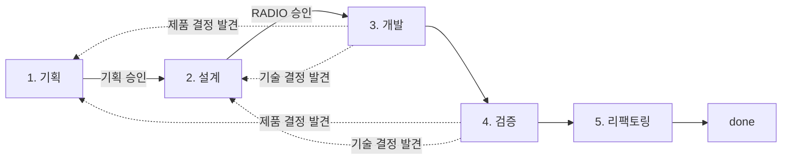

# ADR-0013: 5레이어 프로젝트 구조와 5단계 개발 파이프라인

- 상태: Accepted
- 날짜: 2026-08-03
- 승인: user, 2026-08-03
- 부분 대체: [ADR-0009](0009-two-track-interview-and-engineering-loop.md), [ADR-0011](0011-planning-radio-development-contract.md)
- 관련 문서: [운영 계약](../../workflow/WORKFLOW.md), [handoff 계약](../../workflow/HANDOFF.md), [개발 컨벤션](../DEVELOPMENT.md), [P0 Phase](../../execution/phases/00-foundation.md)

## Context

문서가 `docs/` 한 층에 평평하게 쌓이면서 무엇이 무엇을 지배하는지 파일 위치로 읽히지 않는다. 협업 규약, 제품 정의, 기술 기준, 실행 상태가 같은 깊이에 있어 새 문서의 소속과 변경 절차를 매번 사람이 판단해야 한다.

작업 방식도 트랙 A1(기획 인터뷰), A2(RADIO 개발 인터뷰), B(자율 개발 루프)라는 병렬 트랙 이름을 사용해, 실제로는 하나의 흐름인 작업이 세 개의 별도 절차처럼 보였다. 검증과 리팩토링은 트랙 B 안에 묻혀 명시적인 단계가 아니었다.

또한 세션이 끊기면 진행 맥락이 사라져 인터뷰와 실행 모두 처음부터 다시 설명해야 했다. 하네스 실행 기록과 인터뷰 기록의 형식도 서로 달라 재개 비용이 컸다.

## Decision

### 1. 5레이어 구조

프로젝트를 5개 레이어로 나눈다. 레이어는 물리 디렉터리이자 논리 지배 관계이며, **위 레이어가 아래 레이어를 지배한다**. 아래 레이어는 위 레이어를 바꾸지 못하고, 충돌하면 위 레이어가 기준이다.

| 레이어 | 이름 | 책임 | 소속 파일 |
| --- | --- | --- | --- |
| L1 | 협업 | AI와 사용자의 작업 방식, 승인 규칙, 단계 경계, handoff | `CLAUDE.md`, `AGENTS.md`, `.claude/`, `docs/workflow/WORKFLOW.md`, `docs/workflow/HANDOFF.md` |
| L2 | 제품·도메인 | 무엇을 왜 만드는가. 제품 동작, 불변 규칙, 공통 언어, UX | `docs/product/PRD.md`, `docs/product/DOMAIN.md`, `docs/product/DESIGN.md`, `docs/product/design/` |
| L3 | 기술 기준 | 어떻게 만드는가의 공통 기준. 되돌리기 어려운 결정 | `docs/standards/ARCHITECTURE.md`, `docs/standards/DEVELOPMENT.md`, `docs/standards/adr/` |
| L4 | 계획·실행 | 무엇을 언제 하는가. task 상태, 승인 기록, task별 설계, 실행 증거 | `docs/execution/phases/`, `docs/execution/radio/`, `docs/execution/runs/` |
| L5 | 코드 | 실제 구현과 테스트 | `src/`, `tests/` (미래) |

레이어별 변경 절차는 다음과 같다.

- **L1**: 사용자 승인이 필요하다. 작업 방식 자체를 바꾸므로 ADR로 근거를 남긴다.
- **L2**: 기획 단계의 사용자 승인이 필요하다. 승인 후 PRD → Domain → Design 순서로 정합화한다.
- **L3**: 되돌리기 어려운 결정은 새 ADR을 작성하고, 기존 ADR을 덮어쓰지 않는다. `MUST` 규칙 변경은 설계 단계가 아니라 이 레이어에서 먼저 처리한다.
- **L4**: 상태 전환은 해당 단계의 승인 게이트를 통과해야 한다. 실행 증거는 사후 편집하지 않는다.
- **L5**: L3의 `DEV-*` 규칙과 L4의 승인된 RADIO 범위 안에서만 변경한다.

### 2. 루트 고정 파일의 논리적 소속

`CLAUDE.md`, `AGENTS.md`, `.claude/`는 도구 규약상 저장소 루트에 있어야 인식되므로 물리적으로 이동하지 않는다. 그러나 **논리적으로는 L1에 속한다**. 이 파일들은 L1 정본(`docs/workflow/`)의 요약과 도구 연결이며, 두 곳이 충돌하면 `docs/workflow/`가 기준이다.

`package.json`, `.githooks/`도 같은 이유로 루트에 남고 L1의 도구 연결로 취급한다. 루트에 새 도구 설정이 생기면 같은 규칙을 적용한다.

### 3. 5단계 파이프라인

작업을 병렬 트랙이 아니라 **하나의 순차 파이프라인 5단계**로 정의한다. 기존 트랙 A1은 기획 단계, A2는 설계 단계, B는 개발·검증·리팩토링 단계로 편입한다.

| 단계 | 담당 | 산출물 | 종료 시 task 상태 |
| --- | --- | --- | --- |
| 1. 기획 | 사용자 + AI 인터뷰 | PRD·Domain·Design 정합화, 제품 인수 조건, `product_approval` | `design_pending` |
| 2. 설계 | 사용자 + AI 인터뷰 | `docs/execution/radio/<task-id>-radio.md`, `development_approval`, `radio_ref`, `test_mode`, `check_ids` | `planned` |
| 3. 개발 | AI 실행 | 구현과 테스트, 실행 증거 | `in_progress` |
| 4. 검증 | AI 실행 | 등록 check 결과, 인수 조건 증거 | `in_progress` |
| 5. 리팩토링 | AI 실행 | 동작 변경 없는 구조 정리와 재검증 | `in_progress` → `done` |

- 승인 게이트는 1단계와 2단계 종료 지점 두 곳뿐이다. `dual-approval-v3`의 의미론(제품 승인 + RADIO SHA-256 결속 개발 승인)은 그대로 유지한다.
- 3~5단계는 하나의 `in_progress` 구간이며 사용자가 task ID를 명시했을 때만 시작한다. 하네스는 다음 task를 자동 선택하지 않는다.
- 하네스 파이프라인 내부의 "설계" 단계는 **승인된 RADIO를 구현 세부(파일 목록, 테스트 목록, 작업 순서)로 구체화하는 것만** 담당한다. 새 제품 결정은 1단계, 새 기술 결정은 2단계로 반환하며 실행 중에는 먼저 `blocked`로 안전 중단한다.
- 리팩토링은 별도 task가 아니라 모든 작업의 마지막 단계다. 동작을 바꾸지 않으며, 바꿔야 한다면 2단계로 반환한다.

### 4. handoff 원칙

- 단계 경계마다 handoff를 기록한다. 세션이 끊겨도 다음 세션이 handoff만 읽고 이어갈 수 있어야 한다.
- 하네스 실행과 인터뷰는 **같은 포맷**을 사용한다. 형식과 최소 필드는 [handoff 계약](../../workflow/HANDOFF.md)이 소유한다.
- 기록 위치: 하네스 실행은 `docs/execution/runs/<task-id>/handoff.md`, 인터뷰는 `docs/execution/runs/interviews/<날짜-주제>.md`.
- handoff는 승인 기록이 아니다. 승인의 정본은 `docs/execution/phases/index.jsonl`이며 handoff는 그 상태를 설명하는 실행 증거다.

### 5. 전환 처리

- P0-T29(운영 대시보드)는 제품 승인을 보존한 채 `design_pending`으로 반환한다. 개발 승인과 `radio_ref`는 무효화한다.
- [ADR-0012](0012-static-operations-dashboard.md)는 `보류` 상태로 두고 구조 재편 후 재검토한다.
- 새 하네스 구현은 이 결정의 범위가 아니며 P0-T31에서 수행한다.

## Consequences

- 파일 위치만으로 문서의 권한과 변경 절차를 판단할 수 있어, 새 문서의 소속을 매번 논의하지 않는다.
- 트랙 이름 대신 단계 이름을 쓰므로 "지금 어느 단계인가"라는 질문 하나로 다음 행동이 결정된다.
- 검증과 리팩토링이 명시적 단계가 되어 완료 기준이 구현 통과에서 끝나지 않는다.
- 모든 문서 상호 링크와 `index.jsonl`의 `doc`·`radio_ref` 경로, `index.schema.json`의 경로 패턴이 한 번에 바뀐다. 경로를 참조하는 도구는 새 경로를 따라야 한다.
- 기존 하네스가 제거된 상태이므로 5단계 파이프라인과 handoff의 자동 강제는 P0-T31 완료 전까지 문서 계약으로만 존재한다.
- 완료된 task의 실행 이력과 승인 해시는 소급 변경하지 않는다. `docs/execution/radio/P0-T28-radio.md`는 승인 SHA-256 결속을 유지하기 위해 본문을 수정하지 않으며 옛 경로 표기를 역사 기록으로 남긴다.
