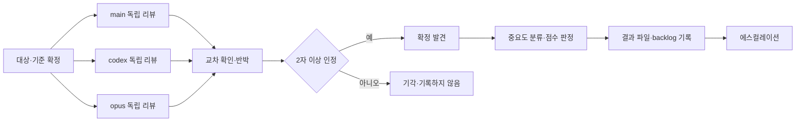

# 교차 검증 계약

- 상태: Accepted
- 기준일: 2026-08-03
- 관련 결정: [ADR-0011](../standards/adr/0011-planning-radio-development-contract.md), [ADR-0013](../standards/adr/0013-project-layer-structure.md)
- 관련 문서: [운영 계약](WORKFLOW.md), [handoff 계약](HANDOFF.md), [개발 컨벤션](../standards/DEVELOPMENT.md)

## 목적

한 에이전트가 자기 작업을 스스로 검토하면 자기 결론을 다시 확인하는 데 그친다. 이 계약은 성격이 다른 리뷰어 셋이 **서로의 결과를 보기 전에 독립으로** 리뷰한 뒤 서로의 발견을 확인·반박하게 해서, 혼자서는 놓치는 결함과 혼자서는 걸러내지 못하는 오탐을 함께 줄인다.

교차 검증은 [운영 계약](WORKFLOW.md)의 4단계(검증)에서 실행하는 절차다. 등록된 `check_ids`를 대체하지 않고 그 위에 얹는다.

- 검증은 **읽기 전용**이다. 리뷰어는 코드를 고치지 않고 발견과 점수만 산출한다. 수정은 검증 결과를 받은 뒤 개발 단계에서 한다.
- 확정 발견과 영역 점수의 정본은 `docs/execution/reviews/`다. 대시보드(P0-T29)는 이 파일을 읽어 표시만 하는 파생물이다.

## 리뷰어와 호출 방식

| 리뷰어 | 식별자 | 호출 방식 | 강점 |
| --- | --- | --- | --- |
| 메인 에이전트 | `main` | 현재 세션이 그대로 리뷰한다 | 요구·RADIO·이전 단계 기록까지 전체 맥락을 안다 |
| Codex 플러그인 | `codex` | `/codex:review`. 설계·가정 자체를 공격해야 하면 `/codex:adversarial-review` | 다른 모델 계열의 시선, 코드 중심 정밀 검토 |
| Claude Opus 서브 에이전트 | `opus` | 독립 서브 에이전트로 호출한다 | 맥락 오염 없이 결과물만 보고 판단 |

- `/codex:review`는 변경 규모가 작으면 `--wait`로 결과를 기다리고, 규모가 크면 `--background`로 띄운 뒤 결과를 회수한다.
- 메인 에이전트는 리뷰어이면서 조정자다. 호출, 취합, 중요도 확정, 점수 판정과 기록을 담당한다.
- 조정자 역할이 곧 결정권은 아니다. 메인 에이전트 혼자 주장하는 발견은 확정되지 않는다.

### 독립성 규칙

- 세 리뷰어는 **서로의 결과를 보기 전에** 각자의 발견 목록과 영역 점수를 먼저 낸다.
- 메인 에이전트는 `codex`·`opus`를 호출할 때 자신의 발견·결론·점수를 전달하지 않는다. 전달하는 것은 대상 범위(기준 커밋, 변경 파일), 관련 spec·RADIO 링크와 이 계약의 평가 영역뿐이다.
- 독립 리뷰가 모두 도착한 뒤에만 교차 확인·반박 단계로 넘어간다.

### Codex를 쓸 수 없을 때 (2자 진행)

- Codex 플러그인을 사용할 수 없으면 `main`·`opus` 2자로 진행한다. 교차 검증을 건너뛰지 않는다.
- 확정 기준은 그대로 **2자 인정**이다. 2자 진행에서는 두 리뷰어가 모두 인정해야 발견이 확정된다.
- 결과 파일의 `participants`에 실제 참여자만 남기고 `participants_note`에 사용할 수 없었던 사실과 사유를 적는다.

## 절차



1. **대상·기준 확정**: 기준 커밋, 리뷰 대상 파일 목록, 관련 spec ID와 승인된 RADIO를 정한다.
2. **독립 리뷰**: 세 리뷰어가 각자 발견 목록(중요도 후보 포함)과 5개 영역 점수를 낸다.
3. **교차 확인·반박**: 발견을 한자리에 모아 각 리뷰어가 다른 리뷰어의 발견을 인정하거나 반박한다. 반박에는 근거가 필요하며 "동의하지 않음"만으로는 기각되지 않는다.
4. **확정**: 2자 이상이 인정한 발견만 남긴다. 인정한 리뷰어를 `agreed_by`에 기록한다.
5. **중요도 분류와 점수 판정**: 메인 에이전트가 확정 발견의 중요도를 정하고 영역 점수를 판정한다.
6. **기록**: 결과 파일과 backlog를 쓴다.
7. **에스컬레이션**: 중요도에 따라 사용자 보고와 상태 전환을 실행한다.

기각된 발견은 결과 파일에도 backlog에도 남기지 않는다. 다만 판단이 갈린 사실 자체가 중요하면 해당 task의 [handoff](HANDOFF.md) 미결 사항에 적는다.

## 평가 영역과 점수

| 영역 | JSON 키 | 보는 것 |
| --- | --- | --- |
| 코드 품질 | `code_quality` | 가독성, 중복, 명명, 함수·모듈 책임, 오류 처리(`DEV-CODE-*`, `DEV-REUSE-*`, `DEV-ERR-*`) |
| 테스트 | `tests` | 위험 대비 테스트 배치, 경계·실패 경로, RED → GREEN 증거, 회귀 보호(`DEV-TEST-*`) |
| 보안 | `security` | 권한·RLS 강제 위치, 입력 검증, 비밀값·개인정보 노출, 감사 기록(`DEV-SEC-*`, `DEV-OBS-*`) |
| 성능 | `performance` | N+1, 무제한 조회, 불필요한 직렬 호출, 캐시·무효화, 근거 없는 최적화(`DEV-OPT-*`, `DEV-CACHE-*`) |
| 아키텍처 정합 | `architecture` | FSD 의존 방향, 서버 경계, 정본 소유권, 승인된 RADIO와 실제 구현의 일치(`DEV-ARCH-*`, `DEV-SSOT-*`) |

- 각 영역은 100점 만점이며 0~100의 정수로 기록한다.
- 각 리뷰어가 영역 점수와 근거를 독립으로 내고, 메인 에이전트가 **확정 발견**과 각 리뷰어의 영역 평가를 근거로 최종 점수를 판정한다. 리뷰어 점수의 산술 평균을 그대로 쓰지 않는다.
- 확정되지 않은 발견은 점수의 근거로 쓰지 않는다.
- 영역별 판정 근거는 `score_rationale`에 한 줄씩 남긴다. 근거 없는 점수는 기록하지 않는다.
- 대상 변경분에 해당 영역의 판단 재료가 없으면(예: 문서 전용 변경의 `performance`) 결함 없음으로 보고 100점을 주되, 판단 재료가 없었다는 사실을 `score_rationale`에 명시한다.
- 종합 점수 `total`은 5개 영역 점수의 산술 평균을 소수점 첫째 자리에서 반올림한 정수다.
- 점수는 통과·실패 기준이 아니라 추세 관찰용 지표다. task 완료 여부는 인수 조건과 등록 check가 판정한다.

## 중요도와 에스컬레이션

| 중요도 | 정의 | 처리 |
| --- | --- | --- |
| `critical` | 보안 취약, 데이터 손실, PRD 불변 규칙 또는 `MUST` 규칙 위반 가능 | 해당 task를 `blocked`로 전환하고 결정 신호·handoff를 기록한 뒤 **즉시 사용자에게 보고**한다 |
| `high` | 실제 동작 오류 가능성 또는 핵심 품질 결함. 데이터·권한을 깨지는 않지만 방치하면 사용자에게 드러난다 | **즉시 사용자에게 보고**하되 개발 루프는 계속한다 |
| `medium` | 동작은 맞지만 유지보수·구조·테스트 공백이 뒤에 비용을 만든다 | backlog에 누적한다 |
| `low` | 사소한 개선, 명명·문체·주석 수준 | backlog에 누적한다 |

- `critical`의 처리 경로는 [연속 루프 규칙](WORKFLOW.md#연속-루프-규칙)의 안전 중단과 같다. 해당 task만 `blocked`로 두고, 그 task에 의존하지 않는 다음 후보로 루프는 이어간다.
- `high`는 루프를 멈추지 않는다. 보고는 즉시 하고 수정 여부·시점은 사용자가 정한다.
- `medium`·`low`는 루프 중 사용자에게 개별 보고하지 않고 backlog와 대시보드로 노출한다.
- 중요도는 메인 에이전트가 확정한다. 리뷰어 간 중요도 판단이 갈리면 **더 높은 쪽**을 택하고 사유를 `description`에 적는다.

## 실행 시점

| 시점 | 대상 | 결과 기록 |
| --- | --- | --- |
| 각 task의 4단계(검증) | 그 task의 변경분(기준 커밋 대비) | `docs/execution/reviews/<task-id>-review.json`, backlog |
| 수동 전체 스캔 | 코드베이스 전체 | backlog와 사용자 보고 (결과 파일 이름 규칙은 [미결 사항](#미결-사항)) |

- 수동 전체 스캔은 사용자가 요청할 때만 실행한다. 절차·평가 영역·중요도 정의는 task 검증과 동일하다.
- 같은 task를 다시 검증하면 결과 파일을 덮어쓰지 않고 최신 기준 커밋의 결과로 갱신하되, 이전 결과의 확정 발견 중 해결되지 않은 항목은 그대로 유지한다.

## 결과 파일 형식

경로는 `docs/execution/reviews/<task-id>-review.json`이며 `<task-id>`는 `P[0-9]+-T[0-9]{2}` 형식이다. 소비자는 이 이름 규칙으로 실제 결과 파일을 식별한다. `example-review.json`은 task ID 형식이 아니므로 실제 결과가 아니라 형식 예시다.

```json
{
  "task_id": "",
  "at": "",
  "base_commit": "",
  "participants": [],
  "participants_note": "",
  "scores": {},
  "score_rationale": {},
  "total": 0,
  "findings": []
}
```

| 필드 | 타입 | 규칙 |
| --- | --- | --- |
| `task_id` | string | 리뷰 대상 task ID. 파일 이름의 `<task-id>`와 같다 |
| `at` | string | 결과를 확정한 시각. ISO 8601 |
| `base_commit` | string | 리뷰 기준 커밋의 전체 SHA-1 40자 |
| `participants` | string[] | 실제로 리뷰를 산출한 리뷰어. `main`·`codex`·`opus`의 부분집합이며 중복 없이 2개 이상 |
| `participants_note` | string | 3자가 모두 참여하지 않았을 때의 사유. 3자 전부면 빈 문자열 |
| `scores` | object | `code_quality`·`tests`·`security`·`performance`·`architecture` 5개 키를 모두 가지며 값은 0~100 정수 |
| `score_rationale` | object | `scores`와 같은 5개 키. 값은 영역 점수의 판정 근거 한 줄 |
| `total` | number | 5개 영역 점수의 산술 평균을 반올림한 정수 |
| `findings` | object[] | 확정 발견만 담는다. 확정 발견이 없으면 빈 배열 |

`findings[]`의 각 항목은 다음과 같다.

| 필드 | 타입 | 규칙 |
| --- | --- | --- |
| `id` | string | 파일 안에서 유일한 식별자. `F-01`부터 순번 |
| `severity` | string | `critical`·`high`·`medium`·`low` 중 하나 |
| `area` | string | `scores`의 5개 키 중 하나 |
| `title` | string | 한 줄 요약 |
| `description` | string | 문제, 영향과 판단 근거. 중요도가 갈렸으면 그 사유도 함께 |
| `file` | string | 저장소 기준 상대 경로. 파일 하나로 특정되지 않으면 대표 디렉터리 경로 |
| `agreed_by` | string[] | 인정한 리뷰어. `main`·`codex`·`opus`의 부분집합이며 중복 없이 **2개 이상**. 1개면 미확정이므로 이 배열에 남지 않는다 |

형식 예시는 [`docs/execution/reviews/example-review.json`](../execution/reviews/example-review.json)이 소유한다. 예시의 task ID와 파일 경로는 가상이며 실제 저장소 파일을 가리키지 않는다.

## backlog 형식

경로는 [`docs/execution/reviews/backlog.md`](../execution/reviews/backlog.md)다. `medium`·`low` 확정 발견을 한 줄씩 누적한다.

```text
- [ ] [severity] [task-id] 제목 — 근거 파일
```

- `severity`는 `medium` 또는 `low`다. `critical`·`high`는 backlog가 아니라 즉시 보고 경로로 처리한다.
- `task-id`는 그 발견이 나온 리뷰의 대상 task ID다.
- `근거 파일`은 결과 파일 `findings[].file`과 같은 값이다.
- 해결하면 줄을 지우지 않고 `- [x]`로 바꾼다. 발견 이력은 남긴다.
- 한 줄 형식을 지킨다. 설명이 길면 결과 파일의 `description`이 소유하고 backlog는 요약만 갖는다.

## 기록 금지 사항

- 비밀값, 토큰, 자격 증명, 개인정보를 결과 파일·backlog·보고 어디에도 적지 않는다(`DEV-SEC-*`, `DEV-OBS-02`).
- 취약점 발견은 재현에 필요한 최소 정보와 파일 경로로 기술하고, 그대로 악용 가능한 payload나 실제 데이터 값을 적지 않는다.
- 리뷰 결과는 저장소에 남는 공개 기록이라고 가정하고 쓴다.

## 개선 사항의 task 승격

- backlog 항목을 task로 만드는 것은 **사용자 승인이 있을 때만** 한다.
- 승격은 [운영 계약](WORKFLOW.md)의 1단계(기획)를 경유한다. 검증 결과가 곧바로 `planned` task가 되지 않는다.
- 리뷰 결과를 근거로 현재 task의 승인 범위를 넓히지 않는다. 범위 밖 개선은 backlog에만 남긴다.

## 미결 사항

- 수동 전체 스캔 결과 파일의 이름 규칙 — 결정 주체: 사용자, 반환할 단계: 설계. 확정 전까지 수동 전체 스캔의 확정 발견은 backlog와 사용자 보고로만 남긴다.
