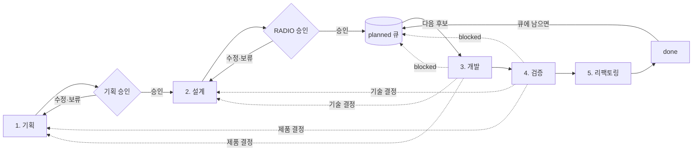

# 5단계 개발 파이프라인 운영 계약

- 상태: Accepted
- 기준일: 2026-08-03
- 관련 결정: [ADR-0013](../standards/adr/0013-project-layer-structure.md), [ADR-0011](../standards/adr/0011-planning-radio-development-contract.md), [ADR-0009](../standards/adr/0009-two-track-interview-and-engineering-loop.md)
- 관련 문서: [handoff 계약](HANDOFF.md), [교차 검증 계약](REVIEW.md)

## 목적

이 프로젝트의 모든 작업은 하나의 순차 파이프라인 5단계를 지난다. 사용자는 앞 두 단계에서 무엇을 왜 만들지, 어떻게 만들지를 각각 승인한다. AI는 두 승인을 모두 받은 task를 뒤의 세 단계에서 구현·검증·정리하며, 실행 가능한 task가 남아 있는 동안 한 번에 하나씩 이어서 처리한다.

사용자 통제 지점은 매 task의 실행 지시가 아니라 앞 두 단계의 승인 게이트다.

병렬 트랙은 없다. 이전 계약의 트랙 A1은 기획 단계, 트랙 A2는 설계 단계, 트랙 B는 개발·검증·리팩토링 단계로 편입되었다. 단, 인터뷰는 실행과 겹칠 수 있다 — [파이프라이닝](#파이프라이닝) 참조.

## 파이프라인 개요



| 단계 | 담당 | 산출물 | 승인 게이트 | handoff 시점 |
| --- | --- | --- | --- | --- |
| 1. 기획 | 사용자 + AI 인터뷰 | PRD·Domain·Design 정합화, task 목표·비목표·제품 인수 조건, `spec_refs`, `product_approval` | **기획 승인** → `design_pending` | 승인 직후 |
| 2. 설계 | 사용자 + AI 인터뷰 | `docs/execution/radio/<task-id>-radio.md`, `development_approval`, `radio_ref`, `test_mode`, `check_ids` | **RADIO 승인** → `planned` | 승인 직후 |
| 3. 개발 | AI 실행 | 구현, 테스트, 실행 증거 | 없음 (`in_progress`) | 단계 종료 시 |
| 4. 검증 | AI 실행 | 등록 check 결과, 교차 검증 결과, 인수 조건 증거 | 없음 (`in_progress`) | 단계 종료 시 |
| 5. 리팩토링 | AI 실행 | 동작 변경 없는 구조 정리와 재검증 | 없음 → `done` | 단계 종료 시 |

- 승인 게이트는 1단계와 2단계 종료 지점 두 곳뿐이다. AI는 승인 없이 다음 단계로 넘어가지 않는다.
- 3~5단계는 하나의 `in_progress` 구간이다. 개발 루프는 `planned` 큐가 빌 때까지 의존성 순서로 task를 연속 실행한다. 자세한 규칙은 [연속 루프 규칙](#연속-루프-규칙)이 소유한다.
- `in_progress`는 한 번에 최대 하나다. 연속 실행은 순차 처리이며 병렬 실행이 아니다.

### 파이프라이닝

기획·설계 인터뷰(1~2단계)는 커밋을 만들지 않으므로 다른 task의 3~5단계 실행과 겹칠 수 있다(2026-08-07 사용자 결정). 설계 인터뷰는 선행 task의 구현 완료를 기다리지 않는다 — 봉인된 선행 RADIO를 계약으로 삼아 미리 진행하고, 선행 구현이 재봉인을 일으키면 영향받는 후속 설계를 재점검한다(2026-08-07 사용자 결정). `in_progress` 최대 1 규칙은 3~5단계에만 적용되며, 인터뷰 대상 task의 상태(proposed·design_pending·planned)는 이 규칙과 무관하다. 인터뷰 산출물(phase 문서 기획 확정, RADIO 초안, index 승인 기록)은 진행 중 task의 게이트(`gate:tdd`·`gate:scope`)와 커밋이 충돌하므로 작업 트리에 두었다가 task 경계에서 커밋한다. `index.jsonl`은 진행 중 task의 worker도 수정하는 파일이므로, 인터뷰로 인한 index 갱신은 task 경계까지 미뤄 스테이징 충돌을 피한다.
- 모든 단계 경계에서 [handoff](HANDOFF.md)를 기록한다. 세션이 끊겨도 handoff만 읽고 이어갈 수 있어야 한다.

## 공통 인터뷰 계약

기획 단계와 설계 단계는 다음 방식을 공유한다.

1. 주 갈래는 깊이 우선으로 하나씩 판다. 서로 독립인 질문은 한 턴에 2~4개까지 묶어 물을 수 있고, 앞 답이 뒤 질문을 바꾸는 의존 질문은 순차로 묻는다(2026-08-07 사용자 결정).
2. 실제 선택이 있으면 장점, 비용과 되돌릴 수 있는 정도가 다른 2~3개 선택지를 제시한다.
3. 구체적인 추천 답변, 이유와 핵심 트레이드오프를 함께 제공한다.
4. 사용자 답변을 `확인된 사실`, `해석`, `가정`, `미결 사항`으로 구분한다.
5. 승인 게이트를 열기 전에 결정용 요약본을 먼저 별도 메시지로 전달한다 — 무엇을 만드나, 기술 접근의 설명, 범위, 효과, 위험, 비용을 전문을 읽지 않고도 판단할 수 있을 만큼 자세히 적는다. 한 화면 표로 과도하게 압축하지 않는다(2026-08-07 사용자 보정). 사용자는 요약본을 근거로 승인 여부를 답한다(2026-08-07 사용자 결정). 요약본과 선택지 초안은 [`explain` 스킬](../../.claude/skills/explain/SKILL.md)을 거친다 — 인터뷰 맥락이 대화에만 있으므로 조정 세션이 그 자리에서 쓰고, 서브 에이전트에 넘기지 않는다.
6. 침묵이나 추천 수락을 추정하지 않고 승인, 수정 또는 보류를 명시적으로 확인한다.
7. 이미 승인된 결정을 충돌이나 공백 없이 다시 열지 않는다.
8. 인터뷰 중 제품 코드를 구현하거나 task를 `in_progress`로 바꾸지 않는다.
9. 승인으로 확정된 도메인 결정은 조정자가 [결정 대장](../product/DECISIONS.md)에 반영한다. 대장은 정본이 아닌 읽기용이며, 정본과 어긋나면 정본이 이긴다(2026-08-07 사용자 결정).

## 1단계: 기획

### 대상

- 제품 목표, 사용자, MVP 범위와 우선순위
- 프로젝트 단계, 리스크, 운영 방식과 성공 기준
- 도메인 언어, 권한 정책, 데이터 수명주기와 불변 규칙
- UX 흐름, 디자인 원칙과 제품 인수 조건
- task 분해와 의존성

### 깊이 전략

모든 결정에서 최소한 다음을 확인한다.

- 행위자, 조회·실행·승인·강제 처리 권한과 개인정보 공개 범위
- 실행 전제조건, 차단·경고·허용 규칙, 상태 전이와 시간 경계
- 데이터 원본, 소유권, 수정·삭제·스냅샷·보존·복구 규칙
- 성공 결과와 파급 효과, 알림, 감사와 운영자가 확인할 정보
- 정상 흐름, 실패·재시도·복구, 수동 예외 처리와 우회 불가 규칙
- MVP 비목표, 의존성, 출시 조건과 검증 가능한 제품 인수 조건

권한, 개인정보, 금액, 출퇴근 원본, 불가역 작업, 외부 서비스, 시간 기반 자동화 또는 동시 변경이 포함되면 다음 경계를 심화한다.

- 경계값과 정확한 시간 경계
- 복수 역할과 자기 자신 처리
- 동시·중복·오래된·역순 요청
- 진행 중 상태 변화, 누락·오염 데이터와 과거 이력
- 데이터 변경 후 알림 실패 같은 부분 실패
- 불변 원본과 후속 확인 사실의 충돌
- 운영자 실수·권한 악용과 감사 회피
- 기기·네트워크·위치·푸시·접근성 차이
- 탈퇴·휴면·취소·만료가 미래·진행 중 작업에 미치는 영향

정상 흐름, 대표 엣지 케이스, 실패·복구, 수동 탈출구, 데이터 이력, 비목표와 검증 증거가 정해져 설계 단계가 제품 판단을 다시 하지 않아도 될 때 기획이 완료된다.

### 인계

사용자 승인 후에만 PRD → Domain → ADR → Architecture·Design → Phase 순서로 문서를 정합화한다. task에 목표, 비목표, 주요 경계 사례, 제품 인수 조건, 의존성, `spec_refs`와 `product_approval`을 기록하고 `design_pending`으로 둔다. 승인 내용과 미결 사항은 `docs/execution/runs/interviews/<날짜-주제>.md`에 handoff로 남긴다.

## 2단계: 설계

### 대상

기획 승인을 받은 `design_pending` task의 구현 요구, 아키텍처, 데이터, 인터페이스와 최적화를 결정한다. 승인된 제품 동작은 다시 결정하지 않는다.

1. **Requirements**: 구현 범위, 불변 규칙, 기술 인수 조건과 테스트 위험
2. **Architecture**: FSD·도메인 책임, 의존 방향, 서버 경계, 보안과 재사용
3. **Data model**: 정본, 스키마, RLS, 수명주기, migration, 트랜잭션과 동시성
4. **Interface**: 입력·DTO·오류·멱등성, 캐시, 오프라인과 외부 계약
5. **Optimizations**: 성능 근거, 관측성, 의존성, 복잡도와 되돌림

모든 task는 RADIO를 갖되 위험에 따라 깊이를 조절한다.

- 문서·문구·기계적 설정: 관련 `DEV-*` 규칙의 적용 상태와 새 결정 유무만 기록한다.
- 일반 기능·UI·API: 작업에 관련된 RADIO 항목과 실제 기술 선택만 인터뷰한다.
- 권한·개인정보·금액·출퇴근·DB·외부 서비스·캐시·오프라인·동시성: 전체 RADIO와 심화 보안·데이터·실패·복구를 검토한다.

공통 규칙을 반복하지 않는다. 각 항목은 규칙 ID와 `기본 적용`, `해당 없음`, `추가 결정`, `예외` 중 하나를 기록하고 상세 내용은 추가 결정이나 허용된 예외에만 쓴다.

### 디자인 확정

화면이 생기거나 바뀌는 task는 RADIO를 봉인하기 전에 **모양을 먼저 정한다.** 코드를 다 짠 뒤에 "이 모양이 아닌데"를 발견하는 것이 가장 비싼 실수이기 때문이다.

거칠지 말지는 **설계 인터뷰에서 변경 경로 초안에 `views/**/ui`가 들어오는 순간** 정해진다. RADIO는 아직 봉인 전이라 코드펜스를 기준으로 삼을 수 없어 인터뷰 중에 판정한다.

절차는 [`/publish-ui` 스킬](../../.claude/skills/publish-ui/SKILL.md)이 소유한다. 요약하면 조정 세션이 시안을 여러 안 만들어 Artifact로 발행하고, 사용자가 고른 안이 확정본이 된다. 시안 HTML과 탈락안, 고른 이유는 `docs/execution/runs/<task-id>/design/`에 남는다.

**디자인은 별도 승인 게이트를 만들지 않는다.** 확정된 모양은 RADIO의 Architecture에 들어가고 RADIO 승인 하나로 함께 봉인된다. 승인 게이트는 여전히 1단계와 2단계 두 곳뿐이다. 시안을 고른 뒤 봉인 전까지는 무를 수 있고, 봉인 후에 모양을 바꾸려면 재봉인이다.

시안은 설계 단계 산출물이라 인터뷰 산출물과 같은 제약을 받는다 — 작업 트리에 두었다가 task 경계에서 커밋한다.

이미 살아 있는 화면을 다시 디자인하려면 리팩토링 task로 올린다. 스킬로 task 없이 코드를 고치지 않는다.

### 인계

승인된 정본은 `docs/execution/radio/<task-id>-radio.md`에 둔다. 여러 task에 영향을 주거나 되돌리기 어려운 결정은 ADR로 승격한다. `development_approval`, `radio_ref`, `test_mode`, 실행 가능한 `check_ids`가 모두 기록된 뒤에만 task를 `planned`로 바꾼다.

### 실행 직전의 구체화

하네스 파이프라인 내부에도 "설계" 순서가 있지만, 이 구체화는 **승인된 RADIO를 구현 세부로 옮기는 작업만** 담당한다.

- 담당: 변경할 파일 목록, 작성할 테스트 목록, 작업 순서와 커밋 단위 결정.
- 담당하지 않음: 새 제품 결정, 새 기술 결정, 승인 범위 확대.
- 새 결정이 필요하면 임의로 정하지 않고 해당 단계(제품은 1단계, 기술은 2단계)로 반환한다.

## 3단계: 개발

개발 루프가 실행 가능한 `planned` task 하나를 선택하면 다음을 수행한다.

1. 선택한 task의 두 승인, RADIO 해시와 의존성을 검증한다.
2. 격리 worktree에서 task 하나만 `in_progress`로 전환한다.
3. `docs/execution/runs/<task-id>/radio.md`에 승인된 RADIO의 적용 결과와 구현 중 차이를 기록한다.
4. `test_mode=tdd` task는 가치 있는 실패 RED를 만든 뒤 같은 명령의 GREEN을 달성한다. RED와 GREEN의 담당은 아래 "테스트 작성과 구현의 분리"가 소유한다.
5. 승인된 범위만 구현한다. 범위 밖 개선은 현재 task에 포함하지 않고 제안으로 기록한다.
6. 기술적 실패는 현재 작업을 보존하면서 설정된 횟수 안에서 자동 재시도한다.

### 테스트 작성과 구현의 분리

`test_mode=tdd` task에서 테스트를 쓰는 주체와 구현하는 주체를 가른다. 같은 사람이 둘 다 하면 테스트가 구현을 따라가고, 그러면 RED는 통과 의식이 될 뿐 설계를 검사하지 못한다.

1. 조정자가 RADIO의 테스트 목록을 **구역별로 배분**한다 — 단일 계층 순수 로직과 화면 컴포넌트는 `unit-test-writer`, 계층을 가로지르는 동작은 `integration-test-writer`, 브라우저 여정은 `e2e-test-writer`. 해당 구역이 없으면 그 writer는 띄우지 않는다.
2. 필요한 writer를 **순차로** 디스패치한다. `in_progress` 최대 1과 같은 worktree를 유지한다.
3. writer는 실패하는 테스트까지만 쓰고 `tdd.json`에 `phase: "red"` 항목을 남긴다. **커밋하지 않는다** — pre-commit이 단위 테스트를 실행하므로 RED 상태로는 커밋이 성립하지 않는다.
4. `implementer`가 그 RED를 GREEN으로 만들고 `phase: "green"` 항목을 남긴다. 커밋은 **GREEN 이후 한 번**이다.
5. `implementer`는 writer가 남긴 테스트를 고치지 않는다. 어떤 구현으로도 만족될 수 없는 단언을 만나면 `[질문]`으로 반환한다 — 그건 봉인된 설계의 결함 신호다.

`tdd.json`의 형식과 `gate:tdd`의 검사는 그대로다. 기록자만 둘로 갈린다.

### 화면이 있는 task의 디스패치 순서

`views/**/ui`를 건드리는 task는 순서가 하나 더 늘어난다.

1. `unit-test-writer`가 **컴포넌트 테스트 RED**를 먼저 남긴다. `config/fsd.json`이 `ui` 세그먼트를 `verifiedBy: ["component", "e2e"]`로 요구하는 그 자리다.
2. [`publisher`](../../.claude/agents/publisher.md)가 봉인된 시안을 화면 코드로 옮겨 그 RED를 GREEN으로 만들고 **UI 커밋 하나**를 남긴다. 목 데이터와 preview 등록까지가 한 벌이다.
3. 남은 writer(`integration-test-writer`·`e2e-test-writer`)가 자기 구역의 RED를 남긴다.
4. `implementer`가 서버·상태·데이터를 `publisher`가 세운 프롭에 꽂고 배선 커밋을 남긴다.

모양을 먼저 고정하면 나중에 흔들리지 않고, 내역에서 UI와 배선이 갈려 되돌리기 쉬워진다. `in_progress` 최대 1과 같은 worktree는 그대로다 — 순차로 돈다.

`publisher`는 화면의 모양만 맡는다. 화면 계산이 필요해지면 `views/**/model/**`은 그 범위 밖이라 `[질문]`으로 돌아온다 — 봉인된 설계가 파생값의 소유자를 안 정했다는 신호다.

`test_mode`가 `tdd`가 아닌 task는 `implementer` 단독으로 진행한다.

## 4단계: 검증

1. task에 등록된 `check_ids`와 관련 회귀 검사를 실행한다.
2. [교차 검증 계약](REVIEW.md)에 따라 이 task의 변경분을 리뷰어 2자(`opus`·`codex`)로 교차 검증하고, 확정 발견과 영역 점수를 `docs/execution/reviews/<task-id>-review.json`에 남긴다. 메인 에이전트는 리뷰어가 아니라 조정자로서 호출·병합·확정·중요도 판독·점수 판정을 맡는다. 실행 절차의 정본은 [`verify` 스킬](../../.claude/skills/verify/SKILL.md), 규칙(점수 산정, 중요도 정의, 결과·backlog 형식)의 정본은 교차 검증 계약이다.
3. 확정 발견의 중요도별 처리는 [교차 검증 계약의 중요도와 에스컬레이션](REVIEW.md#중요도와-에스컬레이션)이 소유한다. `critical`의 안전 중단은 [연속 루프 규칙](#연속-루프-규칙)의 `blocked` 경로와 같다.
4. 인수 조건 충족 증거에 관련 spec ID를 남긴다.
5. 검증 실패가 구현 결함이면 3단계로 돌아간다. 인수 조건이나 기술 계약 자체의 문제이면 해당 인터뷰 단계로 반환한다.
6. 증거는 `docs/execution/runs/<task-id>/`에 남기고 사후 편집하지 않는다.

## 5단계: 리팩토링

1. 검증 GREEN 상태에서 관찰 가능한 동작을 바꾸지 않고 구조·명명·중복만 정리한다.
2. 정리 후 같은 검증을 다시 실행해 GREEN을 확인한다.
3. 동작을 바꿔야 개선되는 항목은 여기서 처리하지 않고 2단계로 반환하거나 새 task로 기록한다.
4. **마무리 커밋 전에 `retrospector`를 디스패치한다.** 실행 증거에서 진행 방식의 성패를 뽑아 [`cases.md`](../execution/retrospective/cases.md)에 한 줄로 누적하고, 개선 제안은 [`proposals.md`](../execution/retrospective/proposals.md)에 남긴다. 산출물은 이 task의 `done` 커밋에 함께 들어가며 `gate:retro`가 그 존재를 강제한다. 형식 계약은 [회고 저장소 README](../execution/retrospective/README.md)가 소유한다. 제안을 task로 만드는 것은 사용자 승인이 있을 때만이다.
5. 단일 commit 계약과 task 상태를 확인한 뒤 통합하고 `done`으로 갱신한다.
6. handoff를 기록하고 [연속 루프 규칙](#연속-루프-규칙)에 따라 다음 `planned` task로 이어간다. 사용자 보고는 루프가 끝날 때 일괄로 한다.
6. task가 최종 상태로 바뀌었으므로 [운영 대시보드](#운영-대시보드)를 재생성한다.

## 연속 루프 규칙

개발 루프는 task 하나를 끝낼 때마다 멈추지 않는다. `planned` 큐가 빌 때까지 의존성 순서로 연속 실행한다.

1. 실행 가능한 `planned` task를 의존성 순서로 고른다. 의존 task가 모두 `done`인 task만 후보다.
2. 후보 하나를 `in_progress`로 두고 3~5단계를 수행한다. `in_progress`는 언제나 최대 하나이며 병렬로 실행하지 않는다.
3. `done`으로 갱신하고 handoff를 기록한 뒤 다음 후보로 이어간다.

### 멈춤과 건너뛰기

| 조건 | 처리 |
| --- | --- |
| `planned` 큐 소진 | 루프를 정상 종료하고 전체 결과를 일괄 보고한다. 보고문은 [`explain` 스킬](../../.claude/skills/explain/SKILL.md)을 거쳐 주니어 개발자 눈높이로 옮긴다. |
| 새 제품·기술 결정이 필요 | 해당 task만 `blocked`로 안전 중단하고 결정 신호와 handoff를 기록한 뒤, 그 task에 의존하지 않는 다음 `planned` task로 계속 진행한다. |
| 기술적 실패가 재시도 한도 초과 | 위와 같이 해당 task만 `blocked`로 두고 루프를 계속한다. |

- `blocked` task에 직접·간접으로 의존하는 task는 후보에서 제외한다. 의존 관계가 없는 task는 영향을 받지 않는다.
- 루프 종료 시 완료한 task, `blocked` task와 각각의 차단 사유를 모아 한 번에 보고한다.
- `blocked` task는 해당 인터뷰 단계에서 결정이 해소되고 재승인된 뒤에 다시 `planned` 큐에 투입한다.

### 루프가 바꾸지 않는 것

- 이중 승인 게이트(`dual-approval-v3`)는 그대로다. 두 승인과 실행 계약이 없는 task는 큐에 들어가지 않는다.
- 승인 범위를 넘는 구현과 새 제품·기술 결정의 임의 확정은 여전히 금지한다.
- 단계 경계 handoff 기록과 인터뷰 반환 원칙은 그대로 적용한다.
- 사용자가 특정 task ID 하나만 실행하도록 지시하면 그 지시가 우선한다.

## 마무리 오프로드 규칙

task를 `done`으로 갱신하고 마무리 문서 커밋을 만든 뒤의 원격 push, CI 감시와 경미한 CI 오류 수정은 조정 세션이 백그라운드로 띄우는 `ci-finisher` 에이전트(`.claude/agents/ci-finisher.md`)가 수행한다. 메인 루프는 push와 CI를 기다리지 않고 다음 task의 인터뷰 단계로 진행한다.

- CI 오류 수정은 `ci-finisher` 서브 에이전트로 수행한다. 봉인된 RADIO의 구현은 `implementer` 서브 에이전트(`.claude/agents/implementer.md`)가 개발 단계에서 수행한다.
- 보조 에이전트의 허용 범위: push(pre-push 빌드 포함), CI 실행 감시, 실패 진단, 경미한 수정의 커밋과 재push. 경미한 수정이란 직전 커밋들의 의도를 바꾸지 않는 CI 전용 정합(워크플로 구성, 캐시, 환경 부트스트랩)과 원인이 자명한 단순 결함의 최소 수정이다. 커밋 메시지는 원 task ID를 사용한다.
- 즉시 에스컬레이션하고 수정하지 않는 것: 제품 동작·승인 범위·설계 판단이 필요한 실패, [교차 검증 계약의 중요도](REVIEW.md#중요도와-에스컬레이션) 기준 `critical`·`high`에 해당하는 실패, 그리고 다음 task가 `in_progress`로 전환된 뒤 커밋이 필요해진 모든 경우 — `gate:scope`가 봉인 경로 밖 커밋을 차단하므로 이때는 보고만 하고 조정자가 task 경계에서 처리 방법을 정한다.
- 다음 worker 디스패치(`in_progress` 전환)는 보조 에이전트의 수정 커밋이 진행 중이지 않을 때만 한다. 기획·설계 인터뷰는 커밋을 만들지 않으므로 CI 감시와 자유롭게 겹칠 수 있다.
- 보조 에이전트의 결과(성공 URL 또는 실패 요약)는 다음 사용자 보고에 포함한다.

## task 경계 보조 에이전트

파이프라인 단계가 아니라 task와 task 사이에서 도는 일이 있다. 문서가 코드 현실을 못 따라가는 것을 잡는 `docs-curator`(`.claude/agents/docs-curator.md`)가 그것이다.

- **언제**: `in_progress`가 비어 있는 task 경계. 조정자가 판단해 띄운다. 매 경계마다 의무로 돌리지 않는다.
- **무엇을**: 1순위 최신화(문서가 인용한 경로·동작이 실제와 같은지), 2순위 SSOT 준수(L1~L5 소유권 위반·중복 서술 — 의미 판단이라 게이트가 못 잡는다), 3순위 구조.
- **직접 고치는 범위**: 깨진 링크, 상호참조, 오탈자, 죽은 경로, 대시보드 재생성.
- **제안만 하는 범위**: PRD·DOMAIN·ADR·봉인된 RADIO의 내용, `index.jsonl`의 승인 기록과 상태. 이 넷은 승인 게이트를 지나 확정된 것이라 보조 에이전트가 바꾸지 않는다.
- **커밋 조건**: `in_progress`가 없을 때만. 있으면 `gate:scope`가 그 task의 허용 경로로 스테이징을 제한하므로 수정만 남기고 보고한다.

기계 검사(`gate:docs`)와 역할이 다르다. 게이트는 링크·제목·`spec_refs`처럼 기계가 판정할 수 있는 것만 보고, 의미가 어긋난 문서는 이 에이전트가 읽어야 잡힌다.

## 상태와 승인 계약

```text
proposed
→ design_pending
→ planned
→ in_progress
→ done
```

- `proposed`: 기획 미승인.
- `design_pending`: `product_approval`은 있으나 RADIO 설계가 미승인.
- `planned`: `product_approval`, `development_approval`, `radio_ref`와 실행 계약이 모두 승인됨.
- `in_progress`: 개발 루프가 선택한 task 하나를 개발·검증·리팩토링 중. 동시에 최대 하나다.
- `blocked`: 실행 중 새 결정이나 재시도 한도 초과로 안전 중단됨. 인터뷰로 해소한 뒤 다시 큐에 투입한다.
- `done`: 인수 조건과 등록 검증을 통과하고 증거가 남음.

모든 task는 schema v3의 `approval_contract`를 명시한다. 전환 전에 종료된 `done`·`skipped`만 `legacy-v2`를 사용하고 실행 상태로 돌아갈 수 없다. 현재 미완료와 신규 task는 `dual-approval-v3`를 사용한다. 이 계약의 개발 승인은 RADIO의 revision과 정확한 전체 파일 SHA-256을 기록하며, 경로·파일·해시가 유효하지 않으면 실행할 수 없다.

`dual-approval-v3` task를 구현하지 않기로 결정하면 사용자, 날짜와 이유가 있는 `skip_approval`로 `skipped` 처리한다. 제품·개발 승인과 RADIO는 건너뛰기의 선행 조건이 아니며 task ID와 이력은 삭제하지 않는다.

3단계로 넘기는 task는 다음 조건을 모두 만족해야 한다.

- 사용자가 기획 범위와 RADIO를 각각 명시적으로 승인했다.
- 목표, 비목표, 주요 경계 사례와 완료 조건이 Phase 문서에 있다.
- 관련 PRD·Domain·ADR·Architecture·Design이 `spec_refs`로 추적된다.
- task별 승인된 RADIO가 `radio_ref`로 연결된다.
- `test_mode`와 실행 가능한 `check_ids`가 있다.
- 의존 task가 모두 `done`이다.
- 구현자가 새 제품 또는 기술 설계를 결정하지 않아도 완료할 수 있다.

하나라도 빠지면 실행할 수 없다.

## 작업 인덱스 규칙

`docs/execution/phases/index.jsonl`은 승인과 실행 상태의 정본이다. 형식 계약은 `docs/execution/phases/index.schema.json`, 운영 설명은 [Phase 실행 계획](../execution/phases/README.md)이 소유한다.

- 한 줄에 하나의 유효한 JSON 객체만 둔다.
- 모든 task는 하나 이상의 유효한 `spec_refs`를 가진다. `spec_refs`는 요구사항 원문 복사가 아니라 추적 링크다.
- task ID, 의존성과 상태를 임의로 재사용하거나 삭제하지 않는다. 폐기한 task도 ID와 이력을 남긴다.
- `kind: task`인 `in_progress`는 저장소 전체에서 언제나 최대 하나다.
- 구현 중 새 작업이 발견되면 현재 task에 몰래 포함하지 않고 해당 단계의 제안으로 기록한다.
- `done` task의 인수 조건을 깨는 변경은 사용자와 회귀 범위를 합의해 새 task로 인계한다.
- 완료된 task의 실행 이력과 승인 해시는 소급 변경하지 않는다.

## 구현 원칙

- MVP 밖 기능은 만들지 않는다. 보류 항목은 별도 승인 없이 현재 Phase에 추가하지 않는다.
- 개인정보와 권한 검사는 UI뿐 아니라 서버 경계와 데이터베이스 정책에서도 강제한다.
- 권한, 예상 급여, 출퇴근, 계정 복구를 바꾸는 변경에는 회귀 테스트를 추가한다.
- 디자인 구현은 기획 단계에서 승인된 Design 범위만 따른다.

세부 규칙은 [개발 컨벤션](../standards/DEVELOPMENT.md)의 `DEV-*` ID가 소유한다.

## 단계 반환과 중단 규칙

- 제품 동작, 범위, 역할, 개인정보 정책 또는 운영 정책 판단은 1단계로 반환한다.
- Architecture, Data model, Interface, Optimizations 또는 공통 개발 규칙의 판단은 2단계로 반환한다.
- `MUST` 규칙은 task RADIO에서 면제하지 않는다. 규칙이 부적절하면 2단계에서 기준 문서와 필요한 ADR을 먼저 변경한다.
- `SHOULD` 예외는 이유, 트레이드오프, 위험, 보완책과 되돌림 조건을 RADIO에 기록하고 사용자 승인을 받는다.
- task를 완료하려면 비목표나 다른 task가 필요할 때 현재 범위에 몰래 포함하지 않는다.

실행 중 새 판단이 발견되면 runner는 task를 먼저 `blocked`로 안전 중단하고 `docs/execution/runs/<task-id>/decision-signal.json`, 격리 작업물과 실행 증거를 보존한다. 결정 신호는 영역, 발견 이유, 영향받는 문서·task, 확정 사항과 미결 질문을 포함한다. 인터뷰가 영역을 확인하기 전에는 승인 기록을 자동 수정하거나 미완성 작업을 삭제·commit하지 않는다.

안전 중단은 루프 전체를 끝내지 않는다. 해당 task만 `blocked`로 두고 [연속 루프 규칙](#연속-루프-규칙)에 따라 그 task에 의존하지 않는 다음 후보로 진행한다.

- 제품 동작이나 범위가 바뀌면 `proposed`로 반환하고 제품·개발 승인을 다시 받는다.
- 기술 설계만 바뀌면 제품 승인을 보존하고 `design_pending`으로 반환해 개발 승인만 다시 받는다.
- 재승인 후에는 새 RADIO 해시와 실행 계약을 검증하고 호환되는 격리 작업물만 이어서 사용한다.

## handoff

- 단계 경계마다 handoff를 기록한다. 형식과 최소 필드는 [handoff 계약](HANDOFF.md)이 소유한다.
- 하네스 실행: `docs/execution/runs/<task-id>/handoff.md`
- 인터뷰: `docs/execution/runs/interviews/<날짜-주제>.md`
- handoff는 승인 기록이 아니다. 승인의 정본은 `docs/execution/phases/index.jsonl`이며 handoff는 그 상태를 설명하는 실행 증거다.

## 운영 대시보드

현재 상태를 한 곳에서 읽는 읽기 전용 진입점이다. 계약의 정본은 [ADR-0012](../standards/adr/0012-static-operations-dashboard.md), 산출물 구성과 표시 내용은 [TOOLING](TOOLING.md#운영-대시보드)이 소유하며 이 절은 실행 위치만 요약한다.

- 생성: `pnpm dashboard`. 산출물은 `docs/execution/dashboard/` 아래 세 파일이며 저장소에 커밋한다.
- 재생성 시점: task가 `done`·`blocked`·`skipped`로 바뀌거나 phase 경계 상태가 바뀐 뒤 AI 세션이 실행한다. 훅·게이트로 강제하지 않는다.
- 대시보드는 파생 표시물이다. 승인, 상태 전환, 실행 순서를 바꾸지 않으며 이 계약의 게이트를 대신하지 않는다. 생성 실패는 task 결과를 막지 않는다.

## 전환 규칙

- 완료된 task는 당시 계약에 따른 이력으로 보존하고 소급 RADIO를 만들지 않는다. 승인 SHA-256에 결속된 RADIO 문서는 본문을 수정하지 않는다.
- P0-T28의 인터뷰 분리 전환은 완료되었다. 통합 딥인터뷰 스킬과 임시 병기 승인 필드는 더 이상 사용하지 않는다.
- 기존 트랙 A1·A2·B 명칭은 폐기한다. 문서와 도구는 기획·설계·개발·검증·리팩토링 단계 이름을 사용한다.
- 기존 하네스가 제거되어 이 계약의 자동 강제는 P0-T31 완료 전까지 문서 계약으로만 존재한다. 그때까지는 사람이 단계 순서와 승인 게이트를 확인한다.
